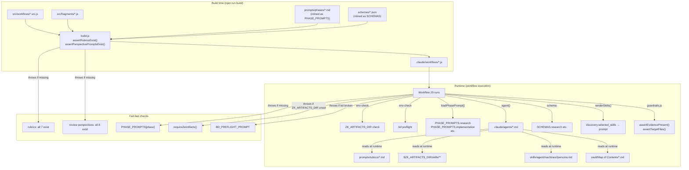
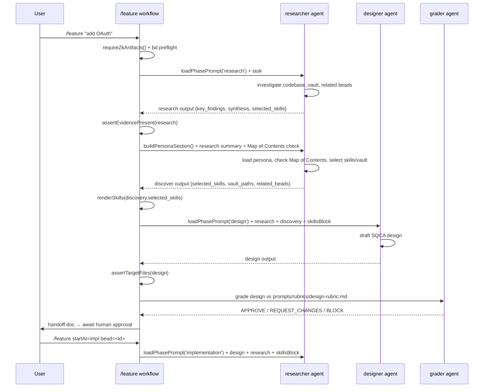

# zk-flow Architecture -- how prompts, workflows, skills, agents, schemas & memory fit together

zk-flow is a **local, interactive** harness for agent lifecycles on Claude Code
**dynamic `/workflows`**. No `gc` supervisor, no `zkc` binary, no cron. You drive it from a
Claude Code session inside this repo.

## The five layers

```
  /feature "<task>"            <- you invoke a saved WORKFLOW (slash command)
        |
   WORKFLOW (src/workflows/*.src.js -> built into .claude/workflows/*.js)
   the orchestration: phase order, gate loops, fan-out, handoff boundaries
        |  spawns subagents with agent(prompt, { agentType, schema })
        v
   AGENT (.claude/agents/<name>.md)        <- a subagent: a PROMPT + model + tools
   its prompt embeds the phase rubric + output contract
        |  reads/loads
        +--> SKILL  ($ZK_ARTIFACTS_DIR/skills/<id>/SKILL.md)   domain how-to, by path
        |  validates output against
        +--> SCHEMA (schemas/<phase>.json, inlined into the workflow)
        |  persists cross-run memory via
        +--> beads (`bd`)  +  reads prose from  vault ($ZK_ARTIFACTS_DIR/vault)
```

### 1. Workflows -- the orchestration (who decides what runs next)
- Authored in `src/workflows/*.src.js`; `build.js` inlines the `src/fragments/*` they declare
  in a `// @@USE:` manifest (replacing `// @@FRAGMENTS@@`) into self-contained
  `.claude/workflows/*.js` (the workflow sandbox has **no `import`/filesystem**, so logic is
  concatenated at build time, not imported).
- A workflow holds the phase pipeline, the bounded gate loops, the fan-out (`parallel`), and
  the boundaries. It calls agents; it does **not** do the work itself.
- Saved workflows are **slash commands** invoked interactively (`/feature ...`). Args
  arrive as a **string** -- every body does `const a = readArgs(args)` then reads `a.depth` etc.

### 2. Agents -- the workers (prompt + model + tools)
- `.claude/agents/<name>.md`: YAML frontmatter (`name`, `description`, `model`, `tools`) + a
  prompt body. 22 agents, flat (no subdirs -- flat is what `agentType` resolves).
- A workflow spawns one with `agent(prompt, { agentType: 'researcher', schema: SCHEMAS.research })`.
- **Execution contract:** an agent's FINAL message is its structured JSON output; the workflow
  captures + validates it via `schema:`. Agents do NOT write phase output to a bead, do NOT call
  `gc`/`zkc`. Feedback + selected skills arrive *in the prompt* (the workflow injects them).

### 3. Skills -- domain how-to (shared, in zk-artifacts)
- Live in `$ZK_ARTIFACTS_DIR/skills/<id>/SKILL.md` (the renamed `zk-artifacts` repo), each with
  template frontmatter (`name`, `description`, `depends_on`). Shared across machines via git.
- An agent loads a skill by **path** (`$ZK_ARTIFACTS_DIR/skills/general/practices/humanizer/SKILL.md`)
  when its prompt selects it. The `discover`/`researcher` phase picks which skills downstream
  phases should load (`discover.json: skills[]`).
- Example: the `handoff` skill (`skills/general/practices/handoff`) is loaded when a workflow
  hits a boundary / needs_human / session-exit and must write a continuation doc.

### 4. Schemas -- the contracts (gate validation)
- `schemas/*.json` (research, design, implementation, review, testing, discover, proposal,
  solution). Ported verbatim from the predecessor's design.
- Used two ways: (a) `schema:` on an `agent()` call forces the agent's output to validate
  (replaces the predecessor's validate step); (b) the gate loop reads the verdict field to
  decide satisfied / iterate / escalate.

### 5. Memory -- beads (structured) + vault (prose)
- **beads (`bd`)** = persistent, queryable run memory + the improve signal. Agents read
  prior learnings (`bd ready`/`bd show`) and write evidence (`bd comment`). Local only.
- **vault** (`$ZK_ARTIFACTS_DIR/vault`) = prose knowledge (solution writeups, notes). The
  `researcher`/`prior-art` agents consult it; `solution-extractor`/`vault-writer` add to it.

## Gates & boundaries (the lifecycle enforcement)
- Every iterating phase runs through `runPhase` (`src/fragments/run-phase.js`): it runs the
  phase agent, then a **`grader` agent** that emits a `review.json` verdict on the output, and
  loops (feeding the grader's findings back into the next iteration) until `APPROVE` or the
  budget is hit. Because the grader supplies the verdict, phases whose own schema has no
  `verdict` field (research/impl/testing) still gate on quality -- they are not free passes.
- Bounded loops (`PHASE_BUDGETS`): research 2, design 2, impl 2, ci 3, review/council 3, testing 2.
- A phase that doesn't reach `APPROVE` within budget escalates: the final agent writes a
  **handoff doc** (`handoffPrompt`) and the workflow returns `{ verdict: 'needs_human' }`.
- **Review council:** 5 parallel perspectives (`DEFAULT_PERSPECTIVES`: advocate, critic,
  security, performance, learning), then the **`arbiter`** agent is the synthesis step
  (dedups same-`file:line` findings -> highest severity, emits the `review.json` verdict).
  The `critique` workflow's council synthesis uses the `grader` instead (design verdict).
- `feature` has a **two-run seam**: run 1 = discover->research->design, then stop with a
  handoff (human approves the design); run 2 (`/feature startAt=impl bead=<id>`) =
  impl->ci->review->testing. Both runs must share the **same `bead=<id>`** so run 2 reads run 1's
  design from beads. This is how an "approval gate" works given workflows can't pause for input.
- **Schema validation contract across seams:** Phase outputs are schema-validated at production
  (`schema:` on `agent()`). Artifacts crossing the bead/process seam (two-run resume,
  cross-workflow handoff) are **re-validated against their schema on load**: run 2 issues two
  separate schema-checked `agent()` loads -- one against `SCHEMAS.design`, one against
  `SCHEMAS.research`. A load agent that cannot produce a schema-valid artifact (bead
  missing/corrupt/incomplete) escalates immediately: it writes a handoff doc (agentType
  `pr-author`) and returns `{ verdict: 'needs_human', reason: 'could not load valid
  design/research from bead' }`. Only when both loads succeed does run 2 proceed to impl.
  Cross-workflow handoffs (`design`, `research`) hand off a `bead=<id>`;
  validation of those artifacts lives on the consuming side (feature run 2), which is the
  pattern above.

### Per-phase model tiers
`src/fragments/model-tiers.js` provides a tiered model-selection scheme (fast/mid/deep) for zk-flow. Every
`agent()` and `runPhase()` call in every workflow receives an explicit `model:` argument
resolved by `modelFor(phase, a)`.

**Tiers (`MODEL_TIERS`):**
| Tier | Model id | Use |
|------|----------|-----|
| `fast` | `claude-haiku-4-5-20251001` | ci-watch, persist/handoff, simple echoes |
| `mid` | `claude-sonnet-4-6` | discover, research, review perspectives, testing |
| `deep` | `claude-opus-4-8` | design, synthesis (arbiter/grader) |

**Default tier per phase (`PHASE_TIER`):**
| Phase | Tier | Rationale |
|-------|------|-----------|
| `discover` | mid | Orientation research |
| `research` | mid | Investigative depth, not design-level |
| `design` | deep | High-stakes architecture decisions |
| `impl` | mid | Code generation at sonnet tier; grader still deep |
| `review` | mid | Perspective fan-out; arbiter does the synthesis |
| `grade` | deep | Arbiter/grader synthesis = verdict authority |
| `testing` | mid | Test execution and evidence capture |
| `ci` | fast | CI check watch (defined; wired in runPhase callers, not runCI) |
| `persist` | fast | Handoff docs, GraderFeedback persist agents |
| `verify` | fast | PR existence check, bead load agents |
| `grill` | mid | Adversarial griller + devils-advocate |

**Arg overrides (resolved at runtime from `readArgs`):**
- `model=<tier|raw-id>` -- global: apply one tier (or raw model id) to every phase call.
  Example: `/feature model=fast ...` -- run all phases on haiku (CI/demo cost mode).
- `models=<phase>:<tier>[,<phase>:<tier>...]` -- per-phase: override specific phases.
  Example: `/feature models=research:deep,impl:fast` -- deep research, cheap impl.
- Per-phase wins over global when both are set.
- Raw model ids pass through unchanged: `model=claude-foo` -> `'claude-foo'` (for testing
  unreleased model strings without changing tier constants).

`runPhase` threads `model` (phase agent) and `gradeModel` (grader agent) separately, so
you can run a cheap phase agent with a deep grader or vice versa via `models=`.

Note: `runCI` (ci-loop.js) is NOT model-threaded; its agents receive no explicit `model:`
and fall back to agent frontmatter defaults. The `ci` tier is defined for symmetry and
available for future `runCI` extension.

## The workflow catalog
| Workflow | Orchestrates |
|---|---|
| `feature` | full lifecycle: discover -> research -> design -> (approve) -> impl -> ci -> review -> testing; pass `skipReview=true` to bypass the review council |
| `bugfix` | discover -> research -> impl -> ci -> testing (no design/review) |
| `refactor` | discover -> research -> refactor -> test (restructures code WITHOUT behavior change; CGC blast-radius before every symbol edit) |
| `debug` | reproduce+root-cause -> fix -> test (diagnoses symptom to ROOT CAUSE with file:line proof, then fixes it; tighter than bugfix) |
| `design` | discover -> research -> design panel -> handoff |
| `research` | discover -> research -> handoff (investigate/spike; stops before design) |
| `test` | test-research -> test-design -> test-run, by `targetEnv` (designs + runs a test strategy, standalone) |
| `review` | depth-gated multi-perspective review (none/light/standard/full) -> arbiter synthesis |
| `critique` | designer -> (devils-advocate || grill) -> response -> 6-perspective council -> grade |
| `grill` | adversarial griller -> decider (interview / one-shot modes) |
| `improve` | (manual) cluster beads feedback -> propose -> verify -> grade -> stage (never auto-merge) |
| `finish-pr` | verify PR -> load context -> impl-fix -> ci -> review -> testing (resume an open PR via pr=<url>) |
| `dashboard` | fetch monitoring dashboard config JSON -> apply change -> verify; optional sibling delete (ops pattern, no code change) |


---

## Workflow Comparison: review vs design vs critique vs grill

These four workflows look similar but serve distinct purposes:

| Workflow | Input | Works on | Multi-perspective? | Output |
|---|---|---|---|---|
| `/review` | current git diff | **Code** — what changed in the repo | YES — 6 perspective agents in parallel | Code quality verdict + findings |
| `/design` | task description | **Proposed work** — discover + research + design | YES — grill + 6-perspective council on the design doc | Design document → human approval seam → impl |
| `/critique` | existing design/brief | **Design artifact** — a doc or spec you already have | YES — 6-perspective council | Design quality verdict, no impl |
| `/grill` | design or PR | **Anything** — focused adversarial interview | NO — one griller + one decider | Adversarial verdict from single reviewer |

Key distinctions:
- `/review` is about **code correctness and quality** — always needs a diff
- `/design` is the **full feature lifecycle's first half** — produces implementation-ready design
- `/critique` is a **standalone design review** — useful when you have a design but no task to implement
- `/grill` is the **sharpest, cheapest adversarial pass** — one agent stress-tests one artifact

---

## Phase → Agent → Schema → Rubric Map

Every phase that runs through `runPhase()` uses a grader. The grader reads the rubric at runtime.

| Phase | Agent(s) | Schema validated | Rubric read by grader |
|---|---|---|---|
| Discover | researcher | schemas/discover.json | *(none — no grader)* |
| Research | researcher | schemas/research.json | prompts/rubrics/research-rubric.md |
| Design | designer + devils-advocate + griller | schemas/design.json | prompts/rubrics/design-rubric.md |
| Impl | scope-locked-editor | *(none explicit)* | prompts/rubrics/implementation-rubric.md |
| CI | evidence-scanner | *(none)* | *(none)* |
| Review perspectives | advocate + critic + security + performance + persona + repo-conventions + learning | schemas/review.json (arbiter output) | prompts/rubrics/review-rubric.md |
| Testing | test-runner | schemas/testing.json | prompts/rubrics/testing-rubric.md |
| Self-improve | reflector + proposal-verifier + grader | schemas/proposal.json | prompts/rubrics/proposal-rubric.md |

**How rubrics work:** The grader agent reads `prompts/rubrics/<phase>-rubric.md` at runtime. If the file doesn't exist, grader falls back to inline criteria. The rubric file is NOT injected by the workflow JS — grader fetches it via Read tool.

**How schemas work:** Inlined at build time from `schemas/*.json` via `build.js`. The `agent()` call passes `schema:` which the runtime enforces on agent output. Missing schema = build error.

**How skills flow:** Researcher globs `$ZK_ARTIFACTS_DIR/skills/**/SKILL.md`, selects relevant ones into `selected_skills[]`, and the `renderSkills()` fragment injects them into downstream designer/impl prompts. If `ZK_ARTIFACTS_DIR` is unset, skill injection is skipped with a console warning.

---

## Fail-Fast Guards (env-check.js + guardrails.js)

Workflow startup order:
1. `requireZkArtifacts()` — ZK_ARTIFACTS_DIR set → handoff if missing
2. `BD_PREFLIGHT_PROMPT` — bd initialized → handoff if missing
3. `assertEvidencePresent()` — after research phase, ensure key_findings/selected_skills non-empty
4. `assertTargetFiles()` — after design phase, ensure affirmed_files declared before impl
5. Rubric existence: grader will warn in output if rubric is absent (runtime check, not workflow check)


---

## Component Wiring Diagram

How every component connects at build time and runtime:



---

## Feature Workflow: Research → Discover → Design Phase Sequence



## Per-workflow reference docs
Each workflow has a dedicated doc (command + args, agents, schemas, fragments, skills/prompts,
gates, + a **mermaid** flow diagram): [`docs/workflows/`](workflows/README.md) -- one file per
workflow + an index grouping them by type and summarizing the 8 schemas.

## Docs
- This architecture overview: `docs/architecture.md`
- Per-workflow reference docs (with mermaid): `docs/workflows/` (see its `README.md`)
- Using zk-flow schemas outside the /workflows runtime: `docs/using-schemas-externally.md`
- Setting up your own artifacts companion: `docs/zk-artifacts-setup.md`
- Project README: `../README.md`

> The original design spec + implementation plan were authored in a separate private
> planning repo; this `docs/` tree is the canonical, self-contained documentation.

## Build & test
- `npm run build` (or `npm install`, via `prepare`) -- generate `.claude/workflows/*.js` from
  `src/workflows/*.src.js`. These files are **gitignored and not committed**; `src/workflows/*.src.js`
  is the source of truth. `build.js` exports `buildWorkflow(name, fragments)` and `fragmentsFor(name)`
  for use in tests.
- `npm test` -- unit tests for the pure fragments (depth map, verdict routing, schemas, arg parsing,
  bd-command builders) plus the **build validity guard** (`tests/build-validity.test.js`), which
  calls `buildWorkflow` for every source and asserts the output (a) contains `export const meta`,
  (b) has no leftover `// @@FRAGMENTS@@` marker, (c) has no `import` lines, and (d) parses.
  The `agent()` orchestration is integration-tested by running the workflows live, not by unit tests.
