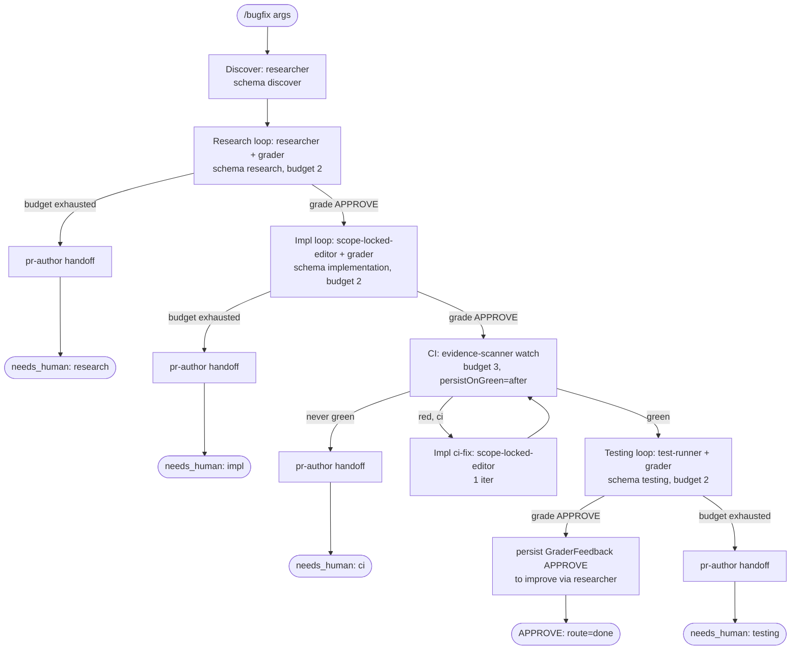

# bugfix workflow

Bug fix lifecycle that runs Discover -> Research -> Impl -> CI -> Testing. Mirrors `feature` minus the design and review phases.

Source: `src/workflows/bugfix.src.js` (`meta.name = 'bugfix'`).

## Command

```
/bugfix <bug report text> [key=value ...]
```

Bare positional tokens collect under `a._` and are treated as the bug report (joined with spaces); if absent the workflow tells agents to "infer from context". `key=value` tokens are parsed by `readArgs`/`parseArgs` only when the key is in the control-key allowlist. Of that allowlist, the args the bugfix body actually consumes are:

| Arg | Meaning | Default / behavior |
|---|---|---|
| `_` (positional) | The bug report text; injected into discover/research/impl prompts and used to derive the bead id. | If empty, prompts say "(infer from context)"; bead id falls back to `zkflow-run`. |
| `bead=<id>` | Correlation/run bead id. Normalized (non `[a-z0-9._-]` -> `-`, lowercased) so case variants (e.g. `ABC-123`) don't throw `assertId`. Pass it to correlate re-runs and avoid sandbox collisions. | If unset, id derived from `pr`, else from `_` slug (first 40 chars), else `zkflow-run`. |
| `pr=<num/url>` | Used only for bead-id derivation here (`zkflow-pr-<slug>`); CI in this workflow does NOT inject a PR number (see CI note). | Unset. |
| `model=<tier|id>` | Global model override applied to every phase. Accepts a tier name (`fast`/`mid`/`deep`) or a raw model id (passthrough). | Unset -> per-phase `PHASE_TIER` defaults. |
| `models=<phase:tier,...>` | Per-phase tier overrides, e.g. `models=research:deep,impl:fast`. Wins over `model` for the named phase. | Unset. |

Other allowlisted control keys (`depth`, `mode`, `maxIterations`, `startAt`, `targetEnv`, `window`, `autoApprove`, `perspectives`, `brief`, `skipReview`) parse without error but are not read by the bugfix body. There is no design or review phase, so `skipReview`/`perspectives` have no effect; iteration counts come from `PHASE_BUDGETS`, not `maxIterations`.

## Flow



Each non-CI phase runs through `runPhase`: the phase agent runs, then a `grader` agent emits a `review.json` verdict; the loop iterates on `REQUEST_CHANGES`/`BLOCK` (feeding `grade.findings` back as feedback) until `APPROVE` or the budget is hit. Phase outputs are persisted to the run bead after each green phase via `persistPhase` (a `researcher` agent runs the `bd comment` shell; this helper passes no model so the persist runs at the researcher's opus-4-8 default). The CI phase uses `runCI` (not `runPhase`): note `implRerunGuard: false`, so a failed ci-fix impl does not early-exit, the CI loop just keeps going until budget.

## Agents

| Agent | Phase | Role | Model tier (default) |
|---|---|---|---|
| `researcher` | Discover, Research; all `persistPhase` helper calls; final GraderFeedback persist | Investigates scope, cites evidence, searches vault/skills, picks downstream skills; also the agent that runs the `bd comment` persistence shells. | Discover/Research: `modelFor('discover'/'research')` -> `mid` (sonnet-4-6). Helper `persistPhase` calls pass NO model -> agent front-matter default opus-4-8. Final GraderFeedback persist: `modelFor('persist')` -> `fast` (haiku-4-5). |
| `grader` | Research, Impl, Testing (gate step of each `runPhase` loop) | Read-only; grades phase output against the phase rubric and emits an `APPROVE`/`REQUEST_CHANGES`/`BLOCK` `review.json` verdict. | Phase graders: `gradeModel = modelFor('grade')` -> `deep` (opus-4-8). The ci-fix grader passes no model -> front-matter default opus-4-8. |
| `scope-locked-editor` | Impl, CI ci-fix | The only writer; applies the code fix constrained to its file boundary. | Impl: `modelFor('impl')` -> `deep` (opus-4-8). ci-fix re-run passes NO model -> front-matter default opus-4-8. |
| `evidence-scanner` | CI | Runs `gh pr checks --watch` and reports `{green, summary}` against the inline CI schema. | CI-check call passes NO model -> front-matter default opus-4-8. (`modelFor('ci')`/`PHASE_TIER.ci=fast` is never invoked by bugfix.) |
| `test-runner` | Testing | Runs the suite / `make smoke` (fallback `make test`), captures structured `TestingOutput`. | `modelFor('testing')` -> `mid` (sonnet-4-6). |
| `pr-author` | Handoff branches (research/impl/testing budget failures, and ci/ci-fix failures via `runCI`) | Writes a handoff document per the handoff skill when a phase exhausts budget. | Bugfix-body handoffs: `modelFor('persist')` -> `fast` (haiku-4-5). The two `runCI` handoffs pass no model -> front-matter default opus-4-8. |

All six agent files exist under `.claude/agents/`, each with YAML `model: claude-sonnet-4-6` front matter. The workflow passes an explicit `model: modelFor(...)` only on the Discover/Research/Impl/Testing phase agents, their phase graders, the bugfix-body `pr-author` handoffs, and the final GraderFeedback persist. The CI-check agent, all `persistPhase` helper calls, the ci-fix re-run (agent + grader), and the `runCI` handoffs pass no `model` and therefore fall through to the opus-4-8 front-matter default (`runPhase` only forwards `model`/`gradeModel` when they are not `undefined`).

## Schemas

| Phase | Schema | Enforces |
|---|---|---|
| Discover | `schemas/discover.json` | Requires `skills`, `vault_paths`, `related_beads`, `rationale`; `additionalProperties:false`. Picks skills to load and vault/bead context for downstream phases. |
| Research | `schemas/research.json` | Requires `outcome` (`const research_complete`), `task_context`, `key_findings[]` (each with `finding`/`evidence`/`evidence_quality`), and overall `evidence_quality` enum. Carries `selected_skills`, `search_coverage` (5 sources), `assumptions`. |
| Impl | `schemas/implementation.json` | Requires `outcome` (lifecycle enum), `files_changed[]`, `commits[]`, `tests_run/passed/failed`, `approach_rationale`. Optional `simplicity_check`. |
| CI | inline schema (in `ci-loop.js`, not a file) | `{ required:['green'], green:boolean, summary:string }`. |
| Testing | `schemas/testing.json` | Requires `outcome` (`testing_complete`/`smoke_unsupported`/`testing_failed`), `smoke_command`, `smoke_exit_code`, `scenarios_exercised[]`. Optional `ci_url`, `fallback_used`, `target_env`. |
| Grade gate (every loop) | `schemas/review.json` | `verdict` enum (`APPROVE`/`REQUEST_CHANGES`/`BLOCK`), `evidence_quality`, `weighted_score` (0-1), and `findings[]` with severity/owner/autofix_class/evidence. |

## Fragments used

Declared in the file header `// @@USE: run-phase,handoff,verdict,budgets,schemas,args,bd-memory,bead-run,ci-loop,model-tiers` (note: bugfix does NOT inline `depth-map`).

- `run-phase` (`src/fragments/run-phase.js`) — `runPhase`: the grade-gated bounded phase loop (phase agent then `grader` against `SCHEMAS.review`, iterate on non-APPROVE).
- `handoff` (`handoff.js`) — `handoffPrompt(summary, suggestedNext)`: builds the prompt instructing an agent to write a handoff doc per the handoff skill.
- `verdict` (`verdict.js`) — `routeVerdict`: maps `APPROVE->done`, `REQUEST_CHANGES->impl`, `BLOCK`/other->`needs_human`. (Available; bugfix relies on `runPhase`'s `ok` flag rather than calling it directly.)
- `budgets` (`budgets.js`) — `PHASE_BUDGETS`: research 2, impl 2, testing 2, ci 3 (the values this workflow reads).
- `schemas` (`schemas.js`) — `SCHEMAS`: the inlined JSON-schema object literals.
- `args` (`args.js`) — `readArgs`/`parseArgs` and the `CONTROL_KEYS` allowlist.
- `bd-memory` (`bd-memory.js`) — `assertId`, `bdWrite` (the `bd create || ... | bd comment --stdin` shell snippet agents run).
- `bead-run` (`bead-run.js`) — `runBeadId` (derive the correlation bead id) and `persistPhase` (spawns a researcher to run `bdWrite`).
- `ci-loop` (`ci-loop.js`) — `runCI`: bounded CI-watch loop with scope-locked-editor ci-fix re-run on red. bugfix calls it with `agentType:'evidence-scanner'`, `implRerunGuard:false`, `persistOnGreen:'after'`.
- `model-tiers` (`model-tiers.js`) — `MODEL_TIERS` (fast=haiku-4-5, mid=sonnet-4-6, deep=opus-4-8), `PHASE_TIER`, and `modelFor(phase, a)` resolving `models`/`model` overrides.

## Skills & prompts

Phase prompts (read by the relevant agent / its grader):

- Research: `prompts/phases/research.md`; rubric `prompts/rubrics/research-rubric.md` (grader checks `selected_skills[]` populated, evidence quality not inflated).
- Implementation: `prompts/phases/implementation.md`; rubric `prompts/rubrics/implementation-rubric.md` (grader BLOCKs with the failing target named if the verifier/CI/tests aren't clean).
- Testing: `prompts/phases/testing.md` (read by `test-runner`); rubric `prompts/rubrics/testing-rubric.md` (`smoke_unsupported` is NOT an auto-BLOCK).
- Grade gate uses `schemas/review.json`; the grader's phase->rubric map lives in `.claude/agents/grader.md`.

Skills pulled by agents (from `$ZK_ARTIFACTS_DIR/skills`):

- `researcher` discovers and selects skills (`glob "$ZK_ARTIFACTS_DIR/skills/**/SKILL.md"`), emitting `selected_skills[]` (path-style ids, e.g. `general/practices/humanizer`, `general/languages/go-development`, `agent/machines/<alias>/clickhouse`). These are rendered into downstream Impl/Testing prompts.
- `scope-locked-editor` and `test-runner` load the skills rendered into their prompt, and may read `$ZK_ARTIFACTS_DIR/skills/<id>/SKILL.md` directly; scope-locked-editor also reads the machine persona at `skills/agent/machines/<host>/persona.md` and runs its Simplicity-First self-check (`simplicity_check`).
- Handoff branches reference the handoff skill `$ZK_ARTIFACTS_DIR/skills/general/practices/handoff/SKILL.md` (confirmed present).

## Gates & escalation

- Budgets (`PHASE_BUDGETS`): research 2, impl 2, testing 2 iterations; CI 3 watch iterations. Each non-CI loop iterates only while the grader returns non-`APPROVE`, feeding `grade.findings` back as feedback.
- `needs_human` triggers: a `runPhase` loop returns `ok:false` (no `APPROVE` within budget) for Research, Impl, or Testing; or `runCI` returns `passed:false` (never green within 3 CI iterations). In each case a `pr-author` handoff doc is written first, then the workflow returns `{ verdict:'needs_human', phase:<name> }`.
- CI specifics: on a red check with `ci < budget`, a single-iteration `scope-locked-editor` ci-fix impl runs and the result replaces `implResult`; because `implRerunGuard:false`, a failed ci-fix does not early-exit (the loop continues). `persistOnGreen:'after'` writes the `CIPassed` bead after the loop. ci-fix runs persist `CIFix` beads.
- Success path: when Testing grades `APPROVE`, the workflow persists `Testing` to the run bead, then a `researcher` writes a `GraderFeedback: {phase:'testing', verdict:'APPROVE', findings:...}` message to the `improve` bead, and returns `{ verdict:'APPROVE', route:'done', impl, testing }`.
- The grader's design-phase circuit breaker (2 consecutive BLOCKs auto-escalate) does not apply here — bugfix has no design or review phase.
