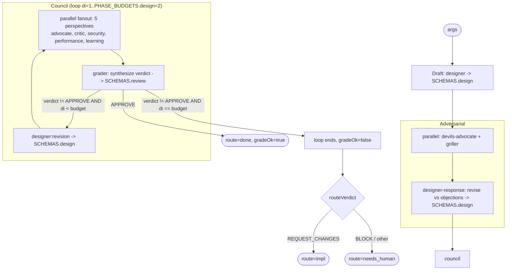

# critique

Produce an SQCA design, harden it with an adversarial pass (devil's advocate + grill), then run a perspective review council that iterates until the design is APPROVE'd or the budget runs out.

## Command

Registered via `meta.name`. Invoked with a free-text arg string (saved-command style), which the `args` fragment's `parseArgs` splits on whitespace into `key=value` control tokens plus bare positional tokens.

```
/critique <brief text...> [model=<tier|id>] [models=design:deep,grade:deep,...] [ideate=true] [frames=5] [topK=3]
```

Only six args are read by this workflow's body. The shared parser recognizes a wider `CONTROL_KEYS` set (`depth, mode, maxIterations, startAt, targetEnv, window, autoApprove, perspectives, bead, brief, skipReview, pr, model, models, ideate, frames, topK`), but this workflow ignores all but the args below. Notably `perspectives` is ignored: the council is hardcoded to `validPerspectives(DEFAULT_PERSPECTIVES)`.

| Arg | Meaning | Default |
|---|---|---|
| `brief` (`a.brief`) | Extra context appended to the Draft prompt. Bare positional text is collected under `a._`, not `a.brief`; pass `brief=...` to populate it. | `''` |
| `model` | Global model override for every phase. Accepts a tier name (`fast`/`mid`/`deep`) or a raw model id (passthrough). | none (per-phase tier) |
| `models` | Per-phase tier overrides, `phase:tier` comma list (e.g. `design:deep,grade:fast`). Phases here: `design`, `grill`, `review`, `grade`. | none |
| `ideate` | Enable ADHD-style wide ideation pre-pass (see below). Set to `true` to activate; default OFF. | `false` |
| `frames` | Number of parallel idea agents in the ideation pre-pass. | `5` |
| `topK` | Number of top ideas the critic selects for the shortlist fed to the designer. | `3` |

## Wide ideation mode (`ideate=true`)

When `ideate=true` is passed, a divergent idea generation pre-pass runs before the Draft phase:

1. `frames` (default 5) parallel `designer` agents each receive the problem + ONE distinct cognitive frame (`minimal`, `radical`, `invert-the-constraint`, `borrow-from-another-domain`, `first-principles`). Each agent is instructed to DIVERGE only -- no evaluation, no anchoring on prior ideas; contexts are isolated.
2. A single `grader` (arbiter) agent scores all ideas on novelty, viability, and fit; flags traps; clusters by angle; and selects the top `topK` (default 3) as a shortlist.
3. The shortlist is prepended to the designer's Draft prompt as "Consider these vetted directions: ...".

When `ideate` is not set (default), behavior is unchanged -- the Draft phase runs as normal with no pre-pass.

## Flow



Note: there is no separate handoff step or enforced circuit breaker in this workflow body. `needs_human` is purely the value `routeVerdict('BLOCK')` returns; the 2-consecutive-block breaker described in `grader.md` is grader guidance, not enforced by this code.

## Agents

All five spawned agent definitions declare `model: claude-opus-4-8` in their frontmatter, but the workflow overrides the model per `agent()` call via `modelFor(phase, a)`. The effective tier below is what this workflow actually requests.

| Agent | Phase | Role | Effective model (modelFor) |
|---|---|---|---|
| `designer` | Draft, Adversarial (response), Council (revision) | Produces/revises the SQCA design document. | `design` -> deep (`claude-opus-4-8`) |
| `devils-advocate` | Adversarial | Fastest single-perspective stress test of the design. | `grill` -> mid (`claude-sonnet-4-6`) |
| `griller` | Adversarial | One-shot grill, emits `challenges[]`. | `grill` -> mid (`claude-sonnet-4-6`) |
| `advocate` | Council | Perspective: finds strengths/positive patterns; counterbalances critic. | `review` -> mid (`claude-sonnet-4-6`) |
| `critic` | Council | Perspective: finds risks/bugs/gaps; counterbalances advocate. | `review` -> mid (`claude-sonnet-4-6`) |
| `security` | Council | Perspective: vulnerabilities, unsafe patterns, attack vectors. | `review` -> mid (`claude-sonnet-4-6`) |
| `performance` | Council | Perspective: latency/memory/resource-exhaustion patterns. | `review` -> mid (`claude-sonnet-4-6`) |
| `learning` | Council | Perspective: extracts reusable knowledge/conventions for the skill system. | `review` -> mid (`claude-sonnet-4-6`) |
| `grader` | Council | Synthesizes the per-iteration verdict (APPROVE/REQUEST_CHANGES/BLOCK) as a ReviewOutput. | `grade` -> deep (`claude-opus-4-8`) |

The five council perspectives come from `DEFAULT_PERSPECTIVES` in the `depth-map` fragment. this workflow does NOT spawn `arbiter` (the 6-perspective set mentioned in grader.md does not apply here). All eight agent files were confirmed present under `.claude/agents/`.

## Schemas

| Phase / call | Schema | Enforces |
|---|---|---|
| Draft `designer`; Adversarial `designer-response`; Council `designer:revision` | `SCHEMAS.design` -> `schemas/design.json` | Required `outcome` (const `design_complete`), `overview`, `approach`, `test_strategy`. Optional structured SQCA fields: `situation`/`question`/`constraints`, `candidates` (minItems 2, each with name + trade_offs), `chosen_approach`, `affected_files`, `acceptance_criteria`, `risks`, `blast_radius` (symbol/callers/risk_level enum), `assumptions`, decomposition (`needs_decomposition`/`subtasks`), `grill_survival` (verdict APPROVE/REVISE/BLOCK), and skill fields (`affirmed_skills`/`skills_added`/`skills_removed`). |
| Council `grader` | `SCHEMAS.review` -> `schemas/review.json` | Required `verdict` (enum APPROVE/REQUEST_CHANGES/BLOCK), `evidence_quality` (strong/adequate/weak), `weighted_score` (0.0-1.0), `findings[]`. Each finding requires title (<=120 chars), severity (P0-P3), file, why_it_matters (<=280), autofix_class (safe_auto/gated_auto/manual/advisory), owner (review_fixer/downstream_resolver/human/release), evidence_quality, and >=1 evidence string. The `verdict` value drives the workflow gate. |

The `devils-advocate` and `griller` calls in the Adversarial phase do not pass a `schema` (free-form objection output).

## Fragments used

Only the six fragments named in the `// @@USE:` header are inlined at build (`depth-map, verdict, budgets, schemas, args, model-tiers`). Other repo fragments (`run-phase`, `bd-memory`, `bead-run`, `ci-loop`, `handoff`) are NOT used here.

- `args` — `parseArgs`/`readArgs`: normalize the free-text `args` (object | string | undefined) into a control-key object.
- `depth-map` — supplies `DEFAULT_PERSPECTIVES` (5 perspectives) and `validPerspectives()` used to build the council fanout. Its `REVIEW_DEPTHS`/`criteriaForDepth` are not exercised (no depth arg).
- `verdict` — `routeVerdict()`: maps the final grader verdict to a route (APPROVE->done, REQUEST_CHANGES->impl, BLOCK/default->needs_human).
- `budgets` — `PHASE_BUDGETS`: the council loop bound is `PHASE_BUDGETS.design = 2`. (`council: 3` exists in this fragment but is unused by this workflow.)
- `schemas` — `SCHEMAS` object; provides `SCHEMAS.design` and `SCHEMAS.review` used for validation.
- `model-tiers` — `MODEL_TIERS`, `PHASE_TIER`, and `modelFor()`: resolves per-call model from phase default tier, honoring `a.model`/`a.models` overrides.

## Skills & prompts

Prompt/rubric linkage is mostly naming correspondence; only the linkages actually present in the agent files are noted as loaded.

- `designer` self-checks against `prompts/rubrics/design-rubric.md` (the only `prompts/` path actually referenced in any spawned agent file). It runs a compliance check against `skills/rules.md`, loads a machine persona from `$ZK_ARTIFACTS_DIR/skills/agent/machines/<host>/persona.md` when set, and treats `affirmed_skills[]` (rendered into its prompt by the workflow; also readable at `$ZK_ARTIFACTS_DIR/skills/<id>/SKILL.md`) as a proposal it may add to / remove from.
- `grader` reads the phase rubric to score against — for this workflow that is `prompts/rubrics/design-rubric.md` (Design) and `prompts/rubrics/review-rubric.md` (Review) per its phase table; it may use CodeGraphContext/Octocode MCP to verify file:line citations and reads affirmed skills from `$ZK_ARTIFACTS_DIR/skills` when present.
- `devils-advocate` and `griller` load affirmed skills from `$ZK_ARTIFACTS_DIR/skills/<id>/SKILL.md` when `$ZK_ARTIFACTS_DIR` is set. Corresponding dispatch prompts exist in the repo (`prompts/dispatch/devils-advocate.md`, `prompts/dispatch/grill.md`) by naming correspondence but are not referenced inside the agent files.
- The five perspective agents (`advocate`, `critic`, `security`, `performance`, `learning`) have matching prompt files under `prompts/review-perspective/review-perspective-<name>.md` by naming correspondence; none of these agent files reference a `prompts/` path directly.
- A canonical design phase prompt exists at `prompts/phases/design.md` (naming correspondence with the Design phase).

## Gates & escalation

- Adversarial pass is non-gating: it always runs once (devil + grill in parallel), then `designer-response` revises against both before the council.
- Council gate: loop `di = 1..PHASE_BUDGETS.design` (= 2). Each iteration regenerates the 5-perspective fanout against the current design, then `grader` emits a `SCHEMAS.review` verdict. `verdict === 'APPROVE'` sets `gradeOk = true` and breaks. If not APPROVE and `di < budget`, `designer` revises and the loop re-reviews. If the budget is exhausted without APPROVE, the loop falls through with `gradeOk = false`.
- Budget exhaustion does not itself escalate; the final verdict (defaulting to `'BLOCK'` if grader never produced one) is routed by `routeVerdict`.
- `needs_human`: returned as `route` whenever the final verdict is `BLOCK` or any unrecognized value (`routeVerdict` default). `REQUEST_CHANGES` routes to `impl`, `APPROVE` to `done`.
- Return shape: `{ design, verdict, route, gradeOk }`. There is no separate handoff artifact or circuit-breaker enforced by this workflow body.
