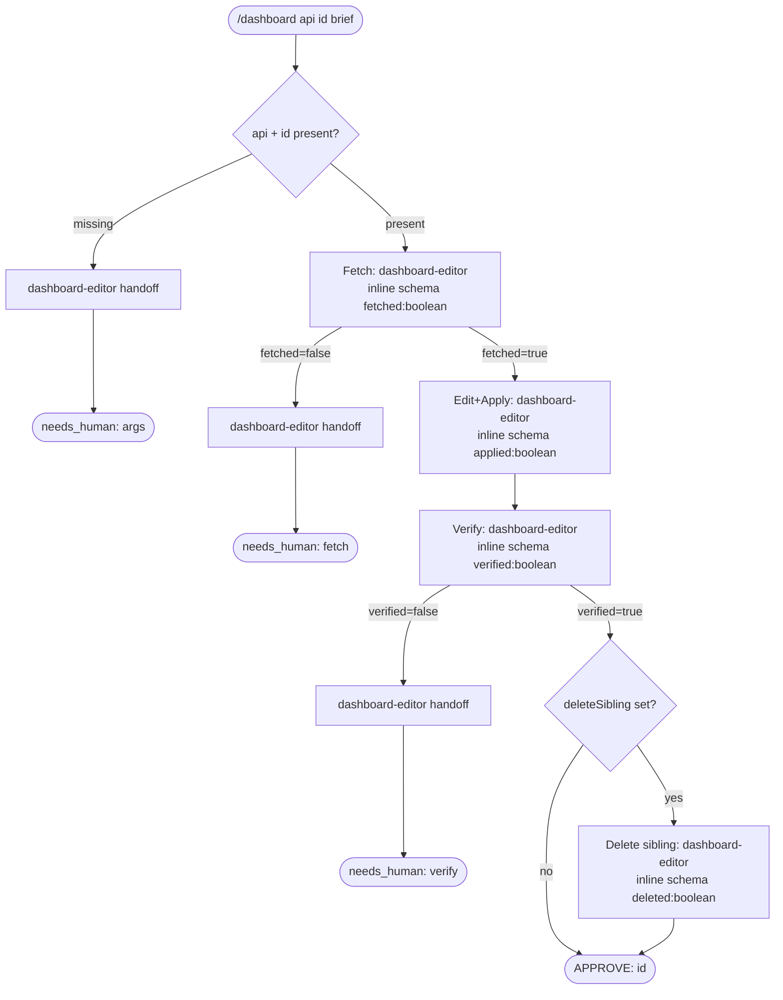

# dashboard workflow

Monitoring dashboard config update: fetch current JSON from a REST API, apply a requested change, POST it back, and verify by re-GETting. Optional sibling-dashboard delete after successful apply.

Source: `src/workflows/dashboard.src.js` (`meta.name = 'dashboard'`).

## Command

```
/dashboard api=<base_url> id=<uid> brief=<change> [deleteSibling=<uid>] [key=value ...]
```

`api` and `id` are required; if either is missing the workflow writes a handoff and returns `needs_human`. `brief` describes the change to apply; if absent the agent infers from context. Key=value tokens are parsed by `readArgs`/`parseArgs` from the control-key allowlist.

| Arg | Meaning | Default / behavior |
|---|---|---|
| `api=<url>` | Base URL of the monitoring API (e.g. `https://grafana.example.com`). **Required.** | Missing -> handoff + `needs_human`. |
| `id=<uid>` | Dashboard UID or resource ID. **Required.** | Missing -> handoff + `needs_human`. |
| `brief=<text>` | Change to make (e.g. `"set alert threshold to 90%"`). | If absent, agent infers from context. |
| `deleteSibling=<uid>` | UID of a dashboard to delete after successful apply+verify. | Unset -- skip delete step. |
| `bead=<id>` | Correlation/run bead id. Normalized to `[a-z0-9._-]`. | Derived from `id` slug if unset. |
| `model=<tier|id>` | Global model override (`fast`/`mid`/`deep` or raw id). | Unset -> per-phase defaults. |
| `models=<phase:tier,...>` | Per-phase tier overrides. Wins over `model`. | Unset. |

## Flow



Phases use plain `agent()` calls (not `runPhase` loops) because the inline schemas carry no `verdict` field -- each phase is a single-shot operation: Fetch confirms the config is reachable, Edit+Apply applies and POSTs the change (idempotent: re-applying the same change is a no-op), and Verify re-GETs to confirm. If Fetch or Verify returns `false`, the workflow writes a handoff doc and returns `needs_human`. Phase outputs are persisted to the run bead via `persistPhase` after each step.

## Agents

| Agent | Phase | Role | Model tier (default) |
|---|---|---|---|
| `dashboard-editor` | Fetch, Edit+Apply, Verify, DeleteSibling, all handoffs | GETs dashboard JSON, applies the requested change, POSTs it back, re-GETs to verify. Auth token from `$GRAFANA_TOKEN` or `apiToken` in prompt; never hardcodes secrets. | Fetch: `modelFor('research',a)` -> `mid` (sonnet-4-6). Edit+Apply: `modelFor('impl',a)` -> `mid` (sonnet-4-6). Verify: `modelFor('verify',a)` -> `fast` (haiku-4-5). Handoffs + delete: `modelFor('persist',a)` -> `fast` (haiku-4-5). |
| `researcher` | All `persistPhase` helper calls | Runs the `bd comment` persistence shell. Passes no explicit `model` -> front-matter default opus-4-8. | Front-matter default: opus-4-8. |

## Schemas

All schemas in this workflow are defined inline (not as `schemas/*.json` files) because the operations are simple boolean-result confirmations, not research/design artifacts.

| Phase | Schema | Enforces |
|---|---|---|
| Fetch | inline `{type:'object',required:['fetched'],properties:{fetched:{type:'boolean'},summary:{type:'string'}}}` | `fetched:boolean` is required; `summary` is optional. If `fetched=false`, workflow escalates immediately. |
| Edit+Apply | inline `{required:['applied'],properties:{applied:{type:'boolean'},summary:{type:'string'}}}` | `applied:boolean` required. Idempotent: if already present, `applied:true` with no-op summary. |
| Verify | inline `{required:['verified'],properties:{verified:{type:'boolean'},summary:{type:'string'}}}` | `verified:boolean` required. If `verified=false`, workflow escalates. |
| DeleteSibling | inline `{required:['deleted'],properties:{deleted:{type:'boolean'},uid:{type:'string'},summary:{type:'string'}}}` | `deleted:boolean` + echo of `uid`. |

## Fragments used

Declared in `// @@USE: run-phase,handoff,budgets,schemas,args,bd-memory,bead-run,model-tiers` (dashboard does NOT use `ci-loop`, `depth-map`, or `verdict`).

- `handoff` (`handoff.js`) -- `handoffPrompt(summary, suggestedNext)`: builds the prompt instructing an agent to write a handoff doc. Used on missing-args, fetch failure, and verify failure.
- `args` (`args.js`) -- `readArgs`/`parseArgs` and the `CONTROL_KEYS` allowlist (includes `api`, `id`, `deleteSibling`).
- `bd-memory` (`bd-memory.js`) -- `assertId`, `bdWrite` (the `bd create || ... | bd comment --stdin` shell snippet).
- `bead-run` (`bead-run.js`) -- `runBeadId` (derive the correlation bead id) and `persistPhase` (spawns a researcher to run `bdWrite`).
- `model-tiers` (`model-tiers.js`) -- `MODEL_TIERS`, `PHASE_TIER`, and `modelFor(phase, a)` resolving `models`/`model` overrides.
- `run-phase`, `budgets`, `schemas` -- declared in `@@USE` and inlined at build time; not called by the dashboard body (no iterating phase loops; inline schemas used instead).

## Skills & prompts

The `dashboard-editor` agent has no external skill dependency. It reads auth tokens from env (`$GRAFANA_TOKEN`), constructs `curl` calls directly, and emits simple JSON.

Handoff branches reference the handoff skill at `$ZK_ARTIFACTS_DIR/skills/general/practices/handoff/SKILL.md` (loaded by the `dashboard-editor` agent when writing the handoff doc).

## Gates & escalation

- **Missing args gate:** if `api` or `id` is not provided, the workflow writes a handoff immediately and returns `{ verdict:'needs_human', phase:'args' }`.
- **Fetch gate:** if `fetchResult.fetched` is false, the workflow writes a handoff and returns `{ verdict:'needs_human', phase:'fetch' }`. Check that the API base URL is reachable and `$GRAFANA_TOKEN` is set.
- **Verify gate:** if `verifyResult.verified` is false, the workflow writes a handoff and returns `{ verdict:'needs_human', phase:'verify' }`. The change was applied but the re-GET did not confirm it; inspect the API response manually.
- **Success path:** when all three phases pass, the workflow returns `{ verdict:'APPROVE', id:a.id }`. If `deleteSibling` was set, the sibling delete runs and its result is persisted before the final return.
