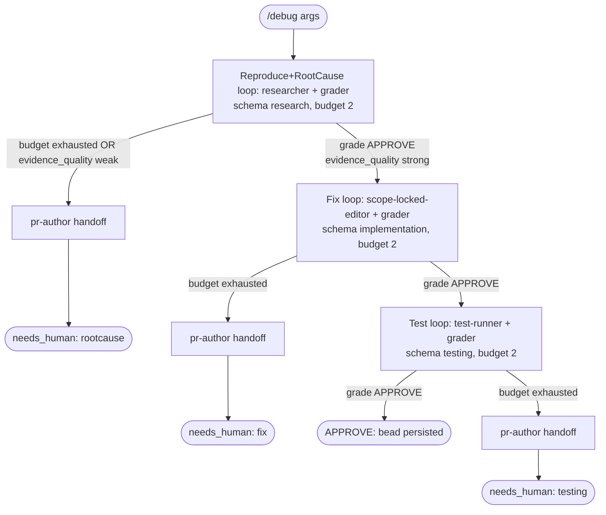

# debug workflow

Debug lifecycle that runs Reproduce+RootCause -> Fix -> Test. Diagnoses a reported symptom to its ROOT CAUSE with file:line evidence, then fixes the root cause (not the symptom) and verifies with a regression test. Tighter than `small-feature`: starts from a symptom and requires proven root cause before proceeding to fix.

Source: `src/workflows/debug.src.js` (`meta.name = 'debug'`).

## Command

```
/debug <symptom text> [key=value ...]
```

Bare positional tokens collect under `a._` and are treated as the symptom description (joined with spaces); `brief=<text>` is preferred when the description contains spaces or special characters. `key=value` tokens are parsed by `readArgs`/`parseArgs` only when the key is in the control-key allowlist. Of that allowlist, the args the debug body actually consumes are:

| Arg | Meaning | Default / behavior |
|---|---|---|
| `brief=<text>` | The symptom/bug report; preferred; injected into all phase prompts. Wins over positional `_` when provided. | Falls back to `a._` joined with spaces, else "(infer from context)". |
| `_` (positional) | Fallback symptom text when `brief` is not set. Used to derive the bead id. | If empty, prompts say "(infer from context)"; bead id falls back to `zkflow-run`. |
| `bead=<id>` | Correlation/run bead id. Normalized (non `[a-z0-9._-]` -> `-`, lowercased). | If unset, derived from `_` slug (first 40 chars), else `zkflow-run`. |
| `model=<tier|id>` | Global model override applied to every phase. Accepts a tier name (`fast`/`mid`/`deep`) or a raw model id (passthrough). | Unset -> per-phase `PHASE_TIER` defaults. |
| `models=<phase:tier,...>` | Per-phase tier overrides, e.g. `models=research:deep,impl:fast`. Wins over `model` for the named phase. | Unset. |

Other allowlisted control keys parse without error but are not read by the debug body. There is no Discover phase (debug is tighter than small-feature), so vault/skill discovery is not separate -- the researcher phase handles it inline.

## Flow



Each phase runs through `runPhase`: the phase agent runs, then a `grader` agent emits a `review.json` verdict; the loop iterates on `REQUEST_CHANGES`/`BLOCK` (feeding `grade.findings` back as feedback) until `APPROVE` or the budget is hit. The grader is explicitly instructed to reject (`REQUEST_CHANGES`) if `evidence_quality` is `weak` or root cause lacks file:line proof -- this is the key gate that distinguishes debug from small-feature. Phase outputs are persisted to the run bead after each phase via `persistPhase`.

## Agents

| Agent | Phase | Role | Model tier (default) |
|---|---|---|---|
| `researcher` | Reproduce+RootCause; all `persistPhase` helper calls | Reproduces the symptom; traces the failing path via CGC/Octocode; identifies root cause with file:line evidence. Grader rejects if evidence is weak. | `modelFor('research')` -> `mid` (sonnet-4-6); grade: `modelFor('grade')` -> `deep` (opus-4-8). Helper `persistPhase` calls pass NO model -> agent front-matter default opus-4-8. |
| `grader` | RootCause, Fix, Test (gate step of each `runPhase` loop) | Grades phase output against rubric; rejects root-cause if `evidence_quality` is `weak` or file:line proof is absent; rejects Fix if it targets symptom rather than cause. | `gradeModel = modelFor('grade')` -> `deep` (opus-4-8). |
| `scope-locked-editor` | Fix | The only writer; applies the root-cause fix and adds a regression test that fails before / passes after. | `modelFor('impl')` -> `mid` (sonnet-4-6); grader still `deep`. |
| `test-runner` | Test | Runs the full suite; confirms the symptom is gone and the regression test passes. | `modelFor('testing')` -> `mid` (sonnet-4-6). |
| `pr-author` | Handoff branches (rootcause/fix/testing budget failures) | Writes a handoff document per the handoff skill when a phase exhausts budget. | `modelFor('persist')` -> `fast` (haiku-4-5). |

## Schemas

| Phase | Schema | Enforces |
|---|---|---|
| Reproduce+RootCause | `schemas/research.json` | Requires `outcome` (`const research_complete`), `task_context`, `key_findings[]` (each with `finding`/`evidence`/`evidence_quality`), and overall `evidence_quality` enum. Grader rejects if `evidence_quality` is `weak` or root cause lacks file:line proof. |
| Fix | `schemas/implementation.json` | Requires `outcome` (lifecycle enum), `files_changed[]`, `commits[]`, `tests_run/passed/failed`, `approach_rationale`. Grader rejects if fix targets symptom rather than root cause, or if regression test is missing. |
| Test | `schemas/testing.json` | Requires `outcome` (`testing_complete`/`smoke_unsupported`/`testing_failed`), `smoke_command`, `smoke_exit_code`, `scenarios_exercised[]`. Grader confirms symptom is gone and regression test passes. |
| Grade gate (every loop) | `schemas/review.json` | `verdict` enum (`APPROVE`/`REQUEST_CHANGES`/`BLOCK`), `evidence_quality`, `weighted_score` (0-1), and `findings[]` with severity/owner/autofix_class/evidence. |

## Fragments used

Declared in the file header `// @@USE: run-phase,handoff,budgets,schemas,args,bd-memory,bead-run,model-tiers` (no ci-loop, no depth-map, no verdict).

- `run-phase` (`src/fragments/run-phase.js`) -- `runPhase`: the grade-gated bounded phase loop.
- `handoff` (`handoff.js`) -- `handoffPrompt(summary, suggestedNext)`: builds the handoff doc prompt.
- `budgets` (`budgets.js`) -- `PHASE_BUDGETS`: research 2, impl 2, testing 2.
- `schemas` (`schemas.js`) -- `SCHEMAS`: the inlined JSON-schema object literals.
- `args` (`args.js`) -- `readArgs`/`parseArgs` and the `CONTROL_KEYS` allowlist.
- `bd-memory` (`bd-memory.js`) -- `assertId`, `bdWrite` (the `bd create || ... | bd comment --stdin` shell snippet agents run).
- `bead-run` (`bead-run.js`) -- `runBeadId` (derive the correlation bead id) and `persistPhase` (spawns a researcher to run `bdWrite`).
- `model-tiers` (`model-tiers.js`) -- `MODEL_TIERS`, `PHASE_TIER`, and `modelFor(phase, a)`.

## Skills & prompts

Phase prompts (read by the relevant agent / its grader):

- Reproduce+RootCause: `prompts/phases/research.md`; rubric `prompts/rubrics/research-rubric.md`. Grader additionally requires: (1) root cause stated with file:line, (2) evidence_quality not `weak`, (3) failing path traced (not just symptom described).
- Fix (impl slot): `prompts/phases/implementation.md`; rubric `prompts/rubrics/implementation-rubric.md`. Grader additionally checks: fix targets root cause, regression test added.
- Test: `prompts/phases/testing.md` (read by `test-runner`); rubric `prompts/rubrics/testing-rubric.md`. Grader confirms symptom is gone + regression test passes.

Skills pulled by agents (from `$ZK_ARTIFACTS_DIR/skills`):

- `researcher` uses CGC/Octocode to trace the failing path, enumerate callers/callees at the failure site, and identify the root cause file:line. Skills discovery happens inline (no separate Discover phase).
- `scope-locked-editor` loads skills rendered into its prompt; applies Simplicity-First self-check (`simplicity_check`); adds the regression test alongside the fix.
- Handoff branches reference the handoff skill `$ZK_ARTIFACTS_DIR/skills/general/practices/handoff/SKILL.md`.

## Gates & escalation

- Budgets (`PHASE_BUDGETS`): rootcause (research slot) 2, fix (impl slot) 2, test 2 iterations.
- `needs_human` triggers: a `runPhase` loop returns `ok:false` (no `APPROVE` within budget) for RootCause, Fix, or Test. In each case a `pr-author` handoff doc is written first, then the workflow returns `{ verdict:'needs_human', phase:<name> }`.
- RootCause hard gate: grader is instructed to return `REQUEST_CHANGES` if `evidence_quality` is `weak` or root cause lacks file:line proof. This forces iteration even if the research schema validates -- quality is enforced by the grader, not just the schema.
- Fix gate: grader checks that the fix addresses the root cause (not just the symptom) and that a regression test is included. A symptom-only fix returns `REQUEST_CHANGES`.
- Success path: when Test grades `APPROVE`, the workflow persists `Test` to the run bead and returns `{ verdict:'APPROVE', bead:<id> }`.
- No Discover phase: debug skips the separate discover step (unlike small-feature/feature). The researcher handles skill/vault orientation inline during the RootCause phase.
- **Backtrack (gate recovery)**: if Fix exhausts its budget + escalation, debug re-runs the prior RootCause phase once per `PHASE_BUDGETS.backtrack` (default `0` = off) with the fix-failure feedback folded in, before `needs_human` — for when the fix keeps failing because the root cause was wrong. Default-off = behavior unchanged. See `docs/designs/2026-06-16-backtrack-gate-recovery.md` + the standardization policy in `docs/architecture.md`.
