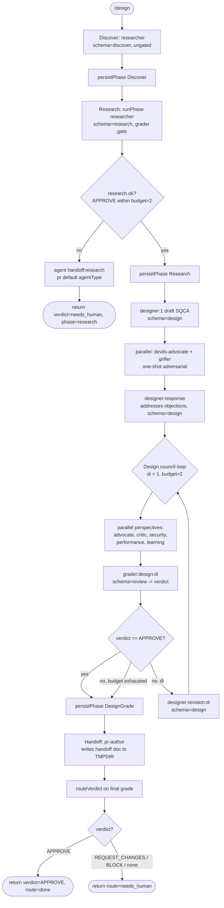

# design

Discover -> research -> design panel that converges a feature design and stops at a handoff boundary; it does NOT implement. Output is a graded SQCA design plus a handoff doc pointing at `/feature startAt=impl bead=<id>`.

## Command

```
/design <free request text> [bead=<id>] [pr=<n>] [model=<tier|id>] [models=phase:tier,...]
```

Saved workflow commands pass free text as `args`; `readArgs`/`parseArgs` split it into `key=value` control tokens plus bare positionals collected under `_`.

Although `parseArgs` recognizes the full `CONTROL_KEYS` set (`depth`, `mode`, `maxIterations`, `startAt`, `targetEnv`, `window`, `autoApprove`, `perspectives`, `brief`, `skipReview`, plus the ones below), the design body only consumes the four below. The rest are parsed-but-ignored by this workflow.

| Arg | Consumed by | Meaning | Default |
|-----|-------------|---------|---------|
| `_` (positional text) | every phase prompt + `runBeadId` | The feature request; if empty, agents infer from context | `(no request text)` |
| `bead=<id>` | `runBeadId(a)` | Explicit bead id to correlate runs; normalized (lowercased, non-`[a-z0-9._-]` -> `-`). Same `bead=` across reruns persists to the same bead | derived: `zkflow-<slug of _>` |
| `pr=<n>` | `runBeadId(a)` (fallback when no `bead`/`_`) | Derives stable id `zkflow-pr-<n>` | unset |
| `model=<tier\|id>` | `modelFor(phase, a)` | Global override for ALL phases; accepts a tier name (`fast`/`mid`/`deep`) or a raw model id | unset (per-phase defaults apply) |
| `models=<p:t,...>` | `modelFor(phase, a)` | Per-phase tier overrides, e.g. `models=design:deep,review:fast`; takes precedence over `model` for matched phases | unset |

## Flow



## Agents

All agents resolve to `.claude/agents/<name>.md`. Model column is the `modelFor(phase)` argument actually passed at the call site (tiers: fast=`claude-haiku-4-5`, mid=`claude-sonnet-4-6`, deep=`claude-sonnet-4-6`).

| Agent | Phase / call site | Role | Model |
|-------|-------------------|------|-------|
| `researcher` | Discover (`discover:1`) | Investigates scope; emits skills/vault paths/related beads | `modelFor('discover')` = mid |
| `researcher` | Research (`research`, via `runPhase`) | Gathers prior art + constraints, cites evidence | `modelFor('research')` = mid |
| `researcher` | persist (`persist:*`) | Runs the `bd` shell that writes phase memory | agent default (no model arg passed) |
| `grader` | research grade + `grader:design:di` | Synthesizes a `review` verdict to gate the loop | `modelFor('grade')` = deep |
| `designer` | Design draft/response/revision | Produces SQCA design (`designer:1`, `:response`, `:revision:di`) | `modelFor('design')` = deep |
| `devils-advocate` | Design adversarial (`devils-advocate`) | One-shot stress test vs domain glossary + code | `modelFor('grill')` = mid |
| `griller` | Design adversarial (`griller`) | One-shot grill, emits `challenges[]` | `modelFor('grill')` = mid |
| `advocate` | Design council perspective | Finds strengths/positive patterns | `modelFor('review')` = mid |
| `critic` | Design council perspective | Finds risks, bugs, gaps | `modelFor('review')` = mid |
| `security` | Design council perspective | Vulnerabilities, unsafe patterns, attack vectors | `modelFor('review')` = mid |
| `performance` | Design council perspective | Latency, memory, resource-exhaustion patterns | `modelFor('review')` = mid |
| `learning` | Design council perspective | Extracts reusable knowledge (does not affect go/no-go) | `modelFor('review')` = mid |
| `pr-author` | Handoff (`handoff:design-complete`) + research-fail handoff | Writes the handoff document; only agent allowed `gh pr create` (unused here) | `modelFor('persist')` = fast |

The council perspectives come from `validPerspectives(DEFAULT_PERSPECTIVES)` = `['advocate','critic','security','performance','learning']` (`persona`/`repo-conventions` are allowed but not in this default set). The research-fail handoff `agent(...)` passes no `agentType`, so it uses the dispatcher default.

## Schemas

Maps to `schemas/<x>.json`. Validated via the `schema:` option on `agent()`/`runPhase`.

| Phase | Schema | Enforces |
|-------|--------|----------|
| Discover | `discover.json` | Requires `skills[]`, `vault_paths[]`, `related_beads[]`, `rationale`; `related_beads` items match `^[a-z0-9-]+$`; `additionalProperties:false` |
| Research | `research.json` | Requires `outcome == "research_complete"`, `task_context`, `key_findings[]` (each with `finding`/`evidence`/`evidence_quality`), top-level `evidence_quality` enum strong/adequate/weak; optional `selected_skills[]`, `search_coverage` (5 sources) |
| Design (draft/response/revision) | `design.json` | Requires `outcome == "design_complete"`, `overview`, `approach`, `test_strategy`; supports SQCA (`situation`/`question`/`constraints`), `candidates[]` (minItems 2), `chosen_approach`, `blast_radius[]`, `acceptance_criteria[]`, `risks[]`, `grill_survival` |
| Design grade (`grader:design:di`) | `review.json` | Requires `verdict` (APPROVE/REQUEST_CHANGES/BLOCK), `evidence_quality`, `weighted_score` (0..1), `findings[]` (each finding needs >=1 evidence ref); optional `perspectives_run[]` |
| Research grade (inside `runPhase`) | `review.json` | Same as above; `verdict==APPROVE` is the loop-exit gate |

## Fragments used

Declared in the `// @@USE:` header and inlined at build time:

- `run-phase` — `runPhase(...)`: grade-gated bounded loop (phase agent then grader emitting a `review` verdict each iteration); used for Research.
- `handoff` — `handoffPrompt(summary, suggestedNext)`: builds the prompt instructing an agent to write a handoff doc to `$TMPDIR` per the handoff skill.
- `depth-map` — `DEFAULT_PERSPECTIVES` + `validPerspectives()`: supplies the design-council perspective list (`REVIEW_DEPTHS`/`criteriaForDepth` unused here).
- `verdict` — `routeVerdict(v)`: maps final grade verdict to a route (APPROVE->done, REQUEST_CHANGES->impl, BLOCK/other->needs_human).
- `budgets` — `PHASE_BUDGETS`: caps iterations (`research:2`, `design:2`).
- `schemas` — `SCHEMAS`: the inlined JSON schema object literals used in `schema:` validation.
- `args` — `readArgs`/`parseArgs`: normalize the `args` string/object into the `a` object.
- `bd-memory` — `bdWrite(id,type,payload)`: builds the `bd create`/`bd comment` shell snippet an agent runs to persist memory.
- `bead-run` — `runBeadId(a)` (id derivation) + `persistPhase(beadId,type,payload)` (dispatches a researcher to run `bdWrite`).
- `model-tiers` — `MODEL_TIERS`/`PHASE_TIER`/`modelFor(phase,a)`: resolves per-phase model ids honoring `model`/`models` overrides.

Note: `ci-loop` is NOT used by this workflow (not in its `@@USE` header).

## Skills & prompts

The workflow itself inlines all its prompt strings; it does not read any file under `prompts/`. Skills and rubrics are pulled at runtime by the spawned agents per their own `.claude/agents/*.md` definitions:

- Handoff skill: `handoffPrompt` directs the `pr-author` (and research-fail handoff agent) to follow `$ZK_ARTIFACTS_DIR/skills/general/practices/handoff/SKILL.md`.
- Researcher: globs `$ZK_ARTIFACTS_DIR/skills/**/SKILL.md`, `vault/Solutions/`, `vault/Notes/` etc.; populates `selected_skills[]` (skill IDs are paths under `$ZK_ARTIFACTS_DIR/skills/`).
- Designer: workflow renders selected skills into its prompt; also reads `$ZK_ARTIFACTS_DIR/skills/agent/machines/<host>/persona.md`, checks design against `skills/rules.md`, and self-checks the 22 criteria in `prompts/rubrics/design-rubric.md`.
- devils-advocate / griller: read the project `CONTEXT.md` domain glossary; may read selected skills.
- Grader: reads the phase rubric per its table — `prompts/rubrics/research-rubric.md` (research grade) and `prompts/rubrics/design-rubric.md` (design grade), plus `schemas/research.json` / `schemas/design.json` / `schemas/review.json` to verify output.
- Council perspectives: each perspective agent applies its own rubric — `prompts/review-perspective/review-perspective-{advocate,critic,security,performance,learning}.md`. (The `arbiter` perspective is not invoked by design.)

## Gates & escalation

Budgets come from `PHASE_BUDGETS`: `research:2`, `design:2`.

- Discover: ungated. Plain `agent()` + `persistPhase`; it cannot fail to human.
- Research gate (`runPhase`, budget 2): each iteration runs the researcher then a `grader`. Exits on `verdict==APPROVE`. If no APPROVE within 2 iterations, `research.ok` is false -> the workflow spawns a `handoff:research` agent and returns `{verdict:'needs_human', phase:'research'}` immediately (does not reach Design).
- Design council loop (budget 2): each iteration fans out the 5 perspectives in parallel, then a `grader` synthesizes a `review` verdict. APPROVE breaks the loop (`designApproved`). On non-APPROVE with iterations remaining, the designer revises and the loop re-reviews the new revision. If the budget is exhausted without APPROVE, the loop falls through to Handoff anyway with the last `grade`.
- Final routing: the return value runs `routeVerdict(grade.verdict)`. `APPROVE -> done`; `REQUEST_CHANGES -> impl`; `BLOCK` or any other/missing verdict -> `needs_human`. So an exhausted design loop typically returns `needs_human`.
- Grader circuit breaker (per `grader.md`): 2 consecutive design `BLOCK` verdicts auto-route to human escalation; the grader is told not to BLOCK just to thrash.
- Handoff boundary: design never implements. The final `pr-author` handoff doc records the verdict and the suggested next step `/feature startAt=impl bead=<beadId>`, instructing a human to review and approve the design before resuming, and to redact secrets.
