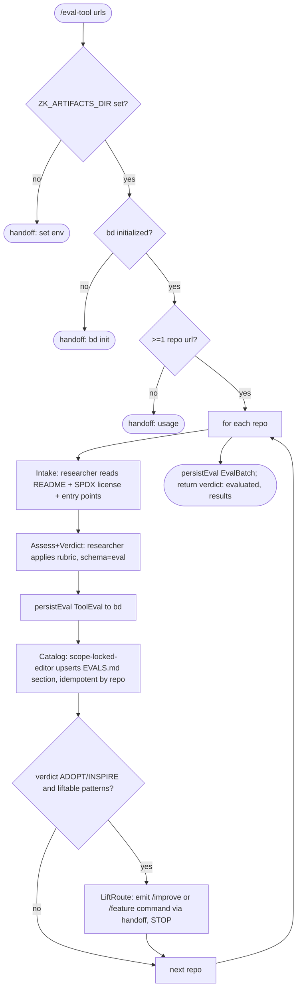

# eval-tool workflow

Evaluate external tools/repos for the zk stack — **adopt / inspire / reject**. Intake a repo, apply the `tooling-eval` rubric, write a verdict to the `EVALS.md` catalog, and (at a seam) emit the command to lift any patterns. The goal is to filter, not to adopt.

## Command

Slash command at `.claude/commands/eval-tool.md`, runs the built workflow `.claude/workflows/eval-tool.js`:

```
/eval-tool <repo-url> [<repo-url> ...] [model=<tier|id>]
```

Repo URLs collect under `_` (bare positional tokens). Each repo runs the full Intake -> Catalog pipeline; lift-route is per-tool. Requires `ZK_ARTIFACTS_DIR` (the `EVALS.md` catalog lives at `$ZK_ARTIFACTS_DIR/skills/general/tools/tooling-eval/EVALS.md`) and an initialized `bd` (run memory).

## Flow



No gate/convergence loop, no CI loop, no auto-merge, no auto-chain. Lift-route stops at a seam and emits a command for the human to run.

## Phases & agents

| Phase | Agent | Role | Model tier |
|-------|-------|------|-----------|
| Intake | `researcher` | Read-only: README, exact SPDX license (`gh api .../license`), entry points, claims. | `modelFor('research')` |
| Assess + Verdict | `researcher` | Applies the `tooling-eval` rubric (license -> overlap -> liftable -> integration fit -> verdict + revisit_if); output validated against `SCHEMAS.eval`. | `modelFor('research')` |
| Catalog | `scope-locked-editor` | Idempotent upsert (by repo) of the entry into `$ZK_ARTIFACTS_DIR/.../EVALS.md`. | `modelFor('persist')` |
| LiftRoute | `researcher` | If ADOPT/INSPIRE with liftable patterns, emit a handoff with the exact `/improve` (skill/prompt-text lift) or `/feature` (code/new-workflow lift) command. STOP. | `MODEL_TIERS.fast` |
| persistEval | `researcher` | Runs the `bdWrite` snippet to persist `ToolEval` / `EvalBatch` run memory to the `zk-flow-eval` bead. | `MODEL_TIERS.fast` |

All referenced agents (`researcher`, `scope-locked-editor`) exist under `.claude/agents/`.

## Schema

| Phase | Schema | Enforces |
|-------|--------|----------|
| Assess+Verdict | `SCHEMAS.eval` -> `schemas/eval.json` | `ToolEval`: required `repo`, `license`, `verdict` (ADOPT/INSPIRE/REJECT), `overlaps`, `liftable_patterns[]`, `integration_analysis`, `revisit_if`; optional `lifecycle`, `evidence[]`. |

## Fragments used

`// @@USE: schemas,bd-memory,args,model-tiers,env-check,handoff,operating-posture`

- `schemas` — `SCHEMAS.eval`.
- `bd-memory` — `bdWrite` for `persistEval`.
- `args` — `readArgs` (repo URLs under `_`).
- `model-tiers` — `MODEL_TIERS`, `modelFor`, `postureFor`.
- `env-check` — `requireZkArtifacts`, `BD_PREFLIGHT_PROMPT`.
- `handoff` — `handoffPrompt` for guards + the lift-route seam.
- `operating-posture` — `postureFor` operating instructions injected into prompts.

Prompts are inlined as `agent()` string args (not `loadPhasePrompt`), so no `prompts/phases/` or `build.js` phase-list change is needed.

## Catalog & skill

The verdict vocabulary, rubric, and entry template live in the `tooling-eval` skill: `$ZK_ARTIFACTS_DIR/skills/general/tools/tooling-eval/SKILL.md`. The catalog of all evals is its sibling `EVALS.md`.

## Gates & escalation

- Env gate: missing `ZK_ARTIFACTS_DIR` -> `needs_human` handoff.
- bd gate: bd not initialized -> `needs_human` handoff.
- Input gate: no repo URL -> `needs_human` handoff with usage.
- License gate (in-rubric): copyleft/BUSL/PolyForm/NOASSERTION forbids ADOPT (INSPIRE still allowed).
- Lift seam: never auto-applies a lift; emits the command for a human to run. Never auto-merges.
