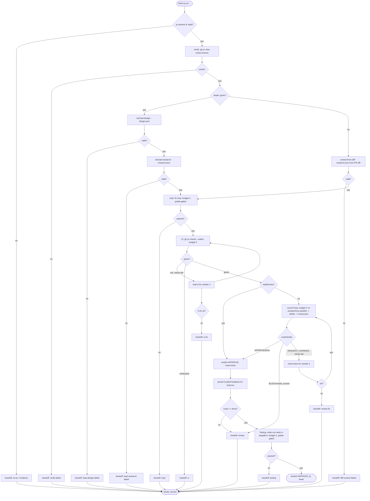

# finish-pr

Resume/finish an existing PR: verify it exists, load prior design/research context (from a bead or the PR diff), run a grade-gated impl-fix loop, watch CI, run an inline review council, then test in a target environment.

## Command

Invoked as a saved workflow command (`meta.name = finish-pr`). Args are passed as free text (`key=value` tokens) and normalized by `readArgs`/`parseArgs`; bare tokens collect under `_`. Only keys in `CONTROL_KEYS` are parsed as flags.

```
finish-pr pr=<url-or-number> [bead=<id>] [skipReview=true] [targetEnv=staging] [model=<tier|id>] [models=research:deep,impl:fast] [perspectives=advocate,critic]
```

| Arg | Meaning | Default |
|---|---|---|
| `pr` | **Required.** Entry point. Must be an integer or a `https://github.com/owner/repo/pull/N` URL (validated by regex to close a `gh pr view` injection vector). | none — missing/invalid yields `needs_human` handoff |
| `bead` | Load schema-validated prior `design.json` + `research.json` across the seam from this bead. If absent, context is derived from the PR diff instead. Also used to derive the run bead id. | none |
| `skipReview` | `'true'`/`true` skips the entire review council; verdict is forced to `APPROVE`. | false |
| `targetEnv` | Environment string injected into the Testing phase prompt. | `local` |
| `perspectives` | Comma list overriding council perspectives. Filtered by `validPerspectives` (only `DEFAULT_PERSPECTIVES` plus `persona`, `repo-conventions` allowed; empty filter falls back to defaults). | `advocate,critic,security,performance,learning` |
| `model` | Global model override for all phases. A tier name (`fast`/`mid`/`deep`) or a raw model id. | per-phase `PHASE_TIER` |
| `models` | Per-phase tier overrides, e.g. `research:deep,impl:fast`. | per-phase `PHASE_TIER` |

Other `CONTROL_KEYS` exist in the shared parser (`depth`, `mode`, `maxIterations`, `startAt`, `window`, `autoApprove`, `brief`) but are **not read** by this workflow's body.

The run bead id (`runBeadId`): `bead=` normalized if given; else `zkflow-pr-<pr-slug>`; else `zkflow-run`.

## Flow



Each lifecycle phase calls `persistPhase` (a `researcher` agent running `bd comment`) on success to write run memory to the bead.

## Agents

All agent names below are confirmed present under `.claude/agents/`. Model tier comes from `modelFor(phase, a)` resolving `PHASE_TIER`, overridable by `model=`/`models=`.

| Agent | Phase | Role | Model tier (default) |
|---|---|---|---|
| `pr-author` | Verify; all handoffs; CI/handoff calls | Runs `gh pr view`/`gh pr checks`, verifies PR exists, writes handoff docs on every failure exit | verify=`fast`, persist=`fast` |
| `researcher` | Context load (bead path); all `persistPhase`/GraderFeedback writes | Reconstructs design/research from bead; runs `bd comment` persistence shell | verify=`fast` (load), persist=`fast` |
| `researcher` | Context load (diff path) | Synthesizes a research-shaped summary from `gh pr diff`/`gh pr view` | research=`mid` |
| `scope-locked-editor` | Impl; impl ci-fix; impl review-fix | Makes scoped edits/commits in `$PWD` to address feedback and failing checks | impl=`deep` |
| `grader` | Grade step of every `runPhase` loop (impl, ci-fix, review-fix, testing) | Scores phase output against the phase rubric, emits `review.json` verdict that gates the loop | grade=`deep` |
| `advocate`,`critic`,`security`,`performance`,`learning` | Review council (parallel) | Each reviews `gh pr diff` from its perspective | review=`mid` |
| `arbiter` | Review council synthesis | Merges duplicate findings, emits the council's `review.json` verdict | grade=`deep` |
| `test-runner` | Testing | Writes and runs tests, verifies changes work in `targetEnv` | testing=`mid` |

Tier ids: `fast`=`claude-haiku-4-5-20251001`, `mid`=`claude-sonnet-4-6`, `deep`=`claude-opus-4-8`.

## Schemas

Each is validated via `SCHEMAS.<x>` (mapped to `schemas/<x>.json`). The grade step inside every `runPhase`/`runCI` loop additionally validates the grader output against `SCHEMAS.review`.

| Phase | Schema | Enforces (required keys) |
|---|---|---|
| Verify | inline (not a SCHEMAS entry) | `required: [exists]`; optional `branch` |
| Context load (bead) | `SCHEMAS.design` + `SCHEMAS.research` | design: `outcome, overview, approach, test_strategy`; research: `outcome, task_context, key_findings, evidence_quality` |
| Context load (diff) | `SCHEMAS.research` | `outcome, task_context, key_findings, evidence_quality` |
| Impl (+ci-fix, +review-fix) | `SCHEMAS.implementation` | `outcome, files_changed, commits, tests_run, tests_passed, tests_failed, approach_rationale` |
| CI | inline (not a SCHEMAS entry) | `required: [green]`; optional `summary` |
| Review (arbiter) + every grade | `SCHEMAS.review` | `verdict, evidence_quality, weighted_score, findings` |
| Testing | `SCHEMAS.testing` | `outcome, smoke_command, smoke_exit_code, scenarios_exercised` |

## Fragments used

Declared in the file's `// @@USE:` header and inlined at build time:

- `run-phase` — `runPhase`: grade-gated bounded loop (run phase agent -> `grader` emits `review.json` -> APPROVE returns ok, else feed findings back, until `maxIterations`).
- `handoff` — `handoffPrompt`: builds the prompt instructing an agent to write a handoff doc to `$TMPDIR` per the handoff skill on any failure exit.
- `budgets` — `PHASE_BUDGETS`: iteration caps (`impl:2`, `ci:3`, `council:3`, `testing:2`).
- `schemas` — `SCHEMAS`: the inlined JSON schema literals (design/research/implementation/review/testing used here).
- `args` — `readArgs`/`parseArgs` + `CONTROL_KEYS`: parses free-text args into `a`.
- `bd-memory` — `bdShow`, `bdWrite`, `assertId`: shell snippets agents run to read/append typed bead evidence comments.
- `bead-run` — `runBeadId` (derive run bead id) and `persistPhase` (write a typed phase payload to the bead via a `researcher`).
- `depth-map` — `DEFAULT_PERSPECTIVES`, `validPerspectives` (council perspective selection/whitelist); `REVIEW_DEPTHS`/`criteriaForDepth` defined but unused here.
- `verdict` — `routeVerdict`: maps `APPROVE->done`, `REQUEST_CHANGES->impl`, `BLOCK`/unknown->`needs_human`.
- `ci-loop` — `runCI`: bounded CI-watch loop with impl re-run on red. Here configured `agentType:'pr-author'`, `pr` injected, `implRerunGuard:true`, `persistOnGreen:'loop'`.
- `model-tiers` — `MODEL_TIERS`, `PHASE_TIER`, `modelFor`: per-phase tier resolution with `model=`/`models=` overrides.

## Skills & prompts

- The `grader` reads the phase rubric to score against: `prompts/rubrics/implementation-rubric.md` (if present; else inline) for the impl/ci-fix/review-fix loops, `prompts/rubrics/review-rubric.md` for arbiter/review grading, and `prompts/rubrics/testing-rubric.md` for the Testing loop. (Phase prompts under `prompts/phases/` exist for design/implementation/research/testing; review is inline in the workflow.)
- The review council perspective agents (`advocate`/`critic`/`security`/`performance`/`learning`) and `arbiter` carry their canonical bodies under `prompts/review-perspective/review-perspective-*.md`. Any P0 from a perspective forces the arbiter toward `BLOCK`.
- Agents pull skills from `$ZK_ARTIFACTS_DIR/skills/<id>/SKILL.md` (rendered into their prompt by the workflow; readable directly when `$ZK_ARTIFACTS_DIR` is set). `scope-locked-editor` also reads machine persona at `$ZK_ARTIFACTS_DIR/skills/agent/machines/<host>/persona.md`. `test-runner` similarly receives task-relevant skills in-prompt.
- Handoff agents follow `$ZK_ARTIFACTS_DIR/skills/general/practices/handoff/SKILL.md` (referenced by `handoffPrompt`).

## Gates & escalation

Budgets (from `PHASE_BUDGETS`): Impl 2 iterations, CI 3 watch cycles, council 3 rounds, Testing 2 iterations.

`needs_human` is returned (after writing a handoff doc) when:
- `pr=` is missing (`handoff:no-pr`) or not a valid integer/GitHub PR URL (`handoff:invalid-pr`).
- Verify reports the PR does not exist (`handoff:verify-failed`).
- bead-path load fails to produce a schema-valid design or research (`handoff:load-design-failed` / `handoff:load-research-failed`); diff-path fails to derive research (`handoff:diff-context-failed`).
- Impl loop exhausts budget without an APPROVE grade (`handoff:impl`).
- CI fails to go green within budget (`handoff:ci`), or a CI-fix impl re-run fails (`handoff:ci-fix`, via `implRerunGuard:true`).
- Review verdict routes to `needs_human` (`BLOCK` or unknown) (`handoff:review`), or a review-fix impl re-run fails (`handoff:review-fix`).
- Testing loop exhausts budget without an APPROVE grade (`handoff:testing`).

Review routing (`routeVerdict` on the arbiter's verdict): `APPROVE` breaks the council loop as done; `REQUEST_CHANGES` triggers a single `impl:review-fix` re-run (only if rounds remain) and re-runs the council; `BLOCK`/unknown breaks to `needs_human`. After the loop, `route !== 'done'` (e.g. council budget exhausted without APPROVE) also escalates. `skipReview=true` bypasses the council entirely with a synthetic `APPROVE`.

Improve hook: regardless of outcome, the review verdict is persisted to bead `improve` as a `GraderFeedback` entry before the final route check.

Success terminal: `{ verdict: 'APPROVE', pr, bead: beadId }` after Testing passes.
