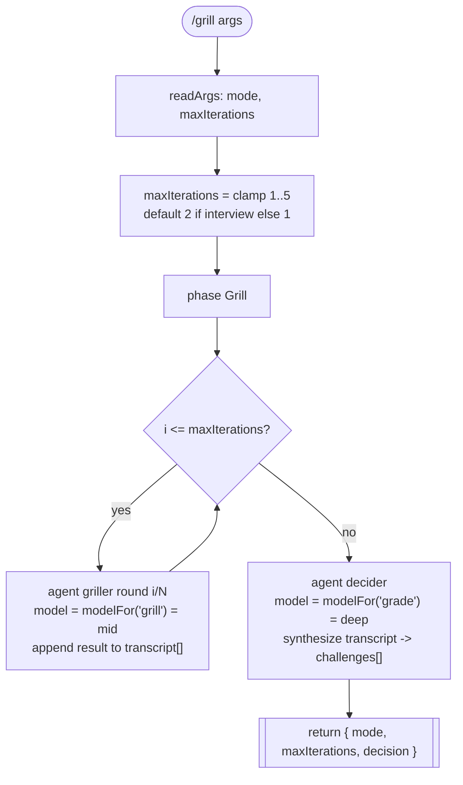

# grill

Adversarial grilling of a design or implementation: a `griller` hunts failure modes and unstated assumptions across N rounds, then a `decider` synthesizes the transcript into structured challenges and a survival verdict.

## Command

```
/grill [mode=one-shot|interview] [maxIterations=N]
```

Wraps `.claude/workflows/grill.js`. Arguments arrive as free text and are parsed by `readArgs`/`parseArgs` (keys must be in the fragment's `CONTROL_KEYS` allowlist; bare tokens fall under `_`).

The workflow body only acts on `mode` and `maxIterations` directly, and passes the whole args object to `modelFor` (so `model` / `models` also take effect). Other `CONTROL_KEYS` (`depth`, `startAt`, `targetEnv`, `window`, `autoApprove`, `perspectives`, `bead`, `brief`, `skipReview`, `pr`) parse without error but are ignored by grill.

| Arg | Meaning | Default |
| --- | --- | --- |
| `mode` | `one-shot` runs the griller once; `interview` iterates multiple rounds, one question at a time | `one-shot` |
| `maxIterations` | Number of griller rounds. Coerced to an integer; clamped to max 5. If absent/invalid, defaults to 2 in `interview` mode, 1 otherwise | 1 (one-shot) / 2 (interview), cap 5 |
| `model` | Global model override (tier name `fast`/`mid`/`deep` OR raw model id) applied to every phase via `modelFor` | none |
| `models` | Per-phase tier overrides, e.g. `grill:deep,grade:fast` | none |

## Flow



Note: this is a linear loop with a single synthesis step. There is no in-workflow gate loop and no `handoff` / `needs_human` branch — the workflow does not branch on the decider's verdict. The `decider` may emit `verdict: "needs_revision"` with `critical_gaps[]`, but that result is returned to the caller (e.g. an upstream design workflow) rather than acted on inside `grill`.

## Agents

Both agents are read-only/advisory and emit a single JSON object as their final message (the workflow captures it; agents do not write to beads). The model column reflects what the workflow passes at spawn time via `modelFor`, which overrides each agent's frontmatter `model:`.

| Agent | Phase | Role | Model tier (workflow spawn) |
| --- | --- | --- | --- |
| `griller` | Grill (looped) | Adversarial interviewer: 3 rounds of "why"/"how do you know" per claim, hunts unstated assumptions and failure modes, challenges terms against `CONTEXT.md`, proposes CONTEXT.md/ADR updates inline | `modelFor('grill')` -> `mid` = `claude-sonnet-4-6` (frontmatter says `claude-sonnet-4-6`; workflow override wins) |
| `decider` | Grill (after loop) | Synthesizes the griller transcript into structured `challenges[]` and a survival verdict (`survives` / `needs_revision`), weighting by real risk; adjudicates glossary and ADR proposals | `modelFor('grade')` -> `deep` = `claude-sonnet-4-6` |

Both agents exist: `.claude/agents/griller.md`, `.claude/agents/decider.md`.

## Schemas

The `grill.src.js` body performs no `SCHEMAS.<x>` validation — it does not import or use the `schemas` fragment, and the decider's output is returned unvalidated. The structured output shapes are enforced only by the agents' own output contracts and acceptance criteria, not by a JSON Schema:

| Phase | Schema | Enforces |
| --- | --- | --- |
| Grill (griller) | none (agent output contract only) | `challenges[]` (target, question, why_it_matters, evidence_required, resolution), `glossary_challenges[]`, `context_updates[]`, `adr_offers[]`, `summary` |
| Grill (decider) | none (agent output contract only) | `verdict` (`survives` \| `needs_revision`), `critical_gaps[]` (non-empty iff `needs_revision`), `secondary_gaps[]`, `glossary_decisions[]`, `adr_decisions[]`, `summary` |

## Fragments used

Declared by `// @@USE: args,model-tiers` at the top of `grill.src.js`:

- `args` (`src/fragments/args.js`) — `parseArgs`/`readArgs`: normalize free-text or object `args` into a key/value object. `CONTROL_KEYS` allowlist gates which `k=v` tokens are recognized; bare tokens collect under `_`.
- `model-tiers` (`src/fragments/model-tiers.js`) — `MODEL_TIERS` (`fast`=haiku-4-5, `mid`=sonnet-4-6, `deep`=opus-4-8), `PHASE_TIER` (defaults: `grill`=`mid`, `grade`=`deep`), and `modelFor(phase, a)` which resolves a model id honoring `a.models` per-phase then `a.model` global override, falling back to the phase tier (else `deep`).

Not used by grill (present in the fragment set but not inlined): `run-phase`, `depth-map`, `verdict`, `budgets`, `bd-memory`, `bead-run`, `schemas`, `ci-loop`, `handoff`.

## Skills & prompts

The `grill.src.js` body references no files under `prompts/` (no rubric or phase-prompt loads). The grilling logic lives in the agent templates themselves.

Skills: the workflow does not select skills explicitly in this source. Per the `griller` template, "selected skills are rendered into your prompt by the workflow," and the agent may also read `$ZK_ARTIFACTS_DIR/skills/<id>/SKILL.md` directly when `$ZK_ARTIFACTS_DIR` is set. The agents read project context from `CONTEXT.md` (domain glossary) and the grilled artifact (`${ZK_TASK_ARTIFACTS_DIR:-$PWD}/design.md` or a PR body), and bootstrap beads memory with `bd ready`.

MCP tool routing pulled by the agents:
- `griller`: `mcp__codegraphcontext__analyze_code_relationships` (blast radius), `mcp__octocode__localGetFileContent` / `lspGotoDefinition` / `lspFindReferences` (verify file:line and symbols), `mcp__repomix__pack_codebase` (module overview), `mcp__plugin_context-mode_context-mode__ctx_batch_execute` (keep large output in sandbox).
- `decider`: `mcp__plugin_context-mode_context-mode__ctx_batch_execute` for large bead output; `Read` for `CONTEXT.md`.

## Gates & escalation

- No budgets: grill does not inline the `budgets` fragment. The only loop bound is `maxIterations` (integer, clamped to 5).
- No `needs_human` / `handoff`: the workflow does not import the `handoff` fragment and does not branch on the verdict. Escalation, if any, is owned by the caller that consumes the returned `decision` object.
- Survival signal: the decider returns `verdict: "survives"` (no unresolved critical gaps) or `verdict: "needs_revision"` (one or more critical gaps remain, `critical_gaps[]` non-empty). This is advice to the upstream design/impl flow, not an enforced gate inside grill.
- Both agents are read-only: no writes to branches, PRs, or beads; no `gh`/`glab` actions (Forge rule).
