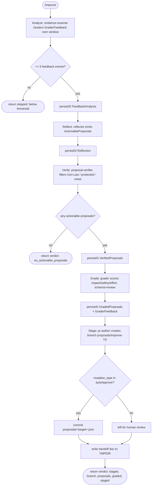

# improve workflow

Manual improvement pipeline: cluster recent `GraderFeedback` beads -> propose mutations -> verify -> grade -> stage as a git branch for human review. Never auto-merges.

## Command

Invocation (slash command at `.claude/commands/improve.md`, runs the built workflow `.claude/workflows/improve.js`):

```
/improve [window=<dur>] [autoApprove=<type1,type2,...>] [model=<tier|id>] [models=<phase:tier,...>]
```

Args are passed as free text and parsed by `readArgs`/`parseArgs` (`src/fragments/args.js`): `key=value` tokens whose key is in `CONTROL_KEYS` become object fields, bare tokens collect under `_`. This workflow only consumes the four args below; the rest of `CONTROL_KEYS` (`depth/mode/maxIterations/startAt/targetEnv/perspectives/bead/brief/skipReview/pr`) are parseable but ignored here.

| Arg | Meaning | Default |
|-----|---------|---------|
| `window` | Time window for clustering feedback events; injected verbatim into the analyze prompt ("over the last `${window}`"). | `'12h'` |
| `autoApprove` | Comma-split list of proposal `mutation_type` values that may be staged without human review. Empty list = everything needs review. NOT a boolean. | `[]` (none auto-approved) |
| `model` | Global model override applied to every phase. A tier name (`fast`/`mid`/`deep`) or a raw model id. Honored via `modelFor`. | unset |
| `models` | Per-phase tier overrides, e.g. `research:deep,grade:fast`. Honored via `modelFor`. | unset |

Note: the command markdown describes `window=N (default 10)` as a bead count and `autoApprove=true` as a flag. That doc is stale; the workflow body treats `window` as a time duration string and `autoApprove` as a comma list of mutation types.

## Inputs

Two signal sources, both counted toward the 5-event threshold:

- **GraderFeedback** bead events over the `window=` (default 12h) — the original input, clustered by phase x rubric x skill.
- **`skill_drift[]` from VaultSync bead entries** — `/vault-sync` detects where a repo skill contradicts the repo's actual code and is deliberately forbidden from editing skills, so those items land here. Each carries `{ skill_id, item, evidence }`, i.e. the skill is already identified and the evidence already gathered. Clusters from this source are tagged `source: 'vault_sync_drift'`.

## Flow



There is no convergence/gate loop, CI loop, or iteration budget in this workflow. The only branches are the two early returns (`skipped`, `no_actionable_proposals`) and the per-proposal autoApprove split at Stage. It never merges to main.

## Agents

`persistSI` runs the `researcher` agent in every one of the five phases to write a typed bead comment; the other agents each run in exactly one phase.

| Agent | Phase | Role | Model tier |
|-------|-------|------|-----------|
| `evidence-scanner` | Analyze | Reads beads (`bd ready`, `bd show improve --json`), clusters `GraderFeedback` by phase/rubric/skill, counts events, returns `{skipped,count}` if <5. | `modelFor('research')` -> `mid` (sonnet-4-6) |
| `reflector` | Reflect | Generates `ActionableProposal`s from the cluster analysis, each targeting an agent/skill/schema/phase. | `modelFor('research')` -> `mid` |
| `proposal-verifier` | Verify | Filters proposals violating Iron Law, targeting protected skills (`$ZK_ARTIFACTS_DIR/protected.json`, absent = empty), or trivial/noise. | `modelFor('research')` -> `mid` |
| `grader` | Grade | Scores/ranks surviving proposals by impact, safety, effort; output validated against the review schema. | `modelFor('grade')` -> `deep` (opus-4-8) |
| `pr-author` | Stage | Creates branch `proposals/improve-<ts>`, writes/commits `proposals/<target>.json` per auto-approved proposal, writes a handoff doc. Never auto-merges. | `modelFor('persist')` -> `fast` (haiku-4-5) |
| `researcher` | all 5 (via `persistSI`) | Runs the `bdWrite` shell snippet to create/append the `improve` bead with typed run memory. | `MODEL_TIERS.fast` (haiku-4-5) |

All six agent definitions exist under `.claude/agents/`.

## Schemas

Only the Grade phase enforces a schema programmatically (passed as `schema:` to the agent call). `SCHEMAS` comes from `src/fragments/schemas.js`, which inlines the JSON files under `schemas/`.

| Phase | Schema | Enforces |
|-------|--------|----------|
| Grade | `SCHEMAS.review` -> `schemas/review.json` | `ReviewOutput`: required `verdict` (APPROVE/REQUEST_CHANGES/BLOCK), `evidence_quality` (strong/adequate/weak), `weighted_score` (0..1), `findings[]` (each with title, severity P0-P3, file, why_it_matters, autofix_class, owner, evidence_quality, evidence[]); optional `perspectives_run`, `dedup_merges`, `suppressed_below_threshold`. |

Not enforced programmatically: `schemas/proposal.json` (`ActionableProposal`: required `finding`, `category`, `proposal`, `target`, `mutation_type`, `priority`, `effort`) is referenced only in the Reflect prompt prose ("conforming to the proposal schema") and in the reflector agent definition; the workflow does not pass it as a `schema:` validator.

## Fragments used

The `// @@USE` directive inlines four fragments (the repo has 11 under `src/fragments/`; this workflow uses only these):

- `schemas` (`schemas.js`) - provides the `SCHEMAS` object re-exporting the JSON schemas; used for `SCHEMAS.review`.
- `bd-memory` (`bd-memory.js`) - provides `bdShow`, `bdReady`, `bdWrite` (and `assertId`); used to read feedback beads and to persist typed run memory to the `improve` bead.
- `args` (`args.js`) - provides `readArgs`/`parseArgs`/`CONTROL_KEYS`; normalizes the free-text `args` into the `a` object.
- `model-tiers` (`model-tiers.js`) - provides `MODEL_TIERS`, `PHASE_TIER`, and `modelFor(phase, a)`; resolves per-phase model ids and honors `model`/`models` overrides.

The Stage prompt's reference to "the handoff skill" is prose instructing pr-author, not the `handoff` fragment; the `handoff` fragment is not inlined here.

## Skills & prompts

These are pulled by the agents (not by the workflow script):

- `reflector` and `proposal-verifier` read the phase prompt `prompts/phases/improvement.md` (proposal-verifier reads it for its role + `ProposalVerdict` shape; reflector follows its full protocol incl. the Part B phase-audit checklist).
- `grader` reads the per-phase rubric `prompts/rubrics/<phase>-rubric.md` and scores only against the criteria listed there.
- `pr-author` writes a handoff doc per the `handoff` skill (`$ZK_ARTIFACTS_DIR/skills/general/practices/handoff/` exists under the artifacts skills dir) to `$TMPDIR`.
- The protected-skills list the verifier/reflector consult (`pack/config/protected-skills.yaml`): `system/development`, `system/cli`, `general/practices/code-guidelines`, `general/practices/code-simplifier`, `general/practices/testing-quality`, `general/practices/advanced-debugging`, `general/practices/prompt-quality`. These are config entries the agents must never propose retiring (they are not directories under the artifacts skills dir).

## Gates & escalation

- Threshold gate (Analyze): if fewer than 5 feedback events in the window, the run returns `{skipped:'below threshold', count}` and does nothing.
- Empty-proposal gate (Verify): if no actionable proposals survive filtering, the run returns `{verdict:'no_actionable_proposals', analysis}`.
- Protected/Iron-Law gate (Verify): proposal-verifier drops proposals that violate the Iron Law, target protected skills, or are noise.
- Auto-approve gate (Stage): only proposals whose `mutation_type` is in the `autoApprove` list are committed; all others are left for human review (the staged result reports `staged[]` vs `skipped[]`).
- Human handoff: Stage always stages to a fresh git branch `proposals/improve-<Date.now()>` and writes a handoff doc to `$TMPDIR`; it never auto-merges to main, so a human always reviews/merges.
- No budget or iteration gate: this workflow does not use the `budgets` fragment and does not read `maxIterations`; there is no cost/iteration cap and no `needs_human` escalation token - escalation is structural (branch + handoff for human review).
