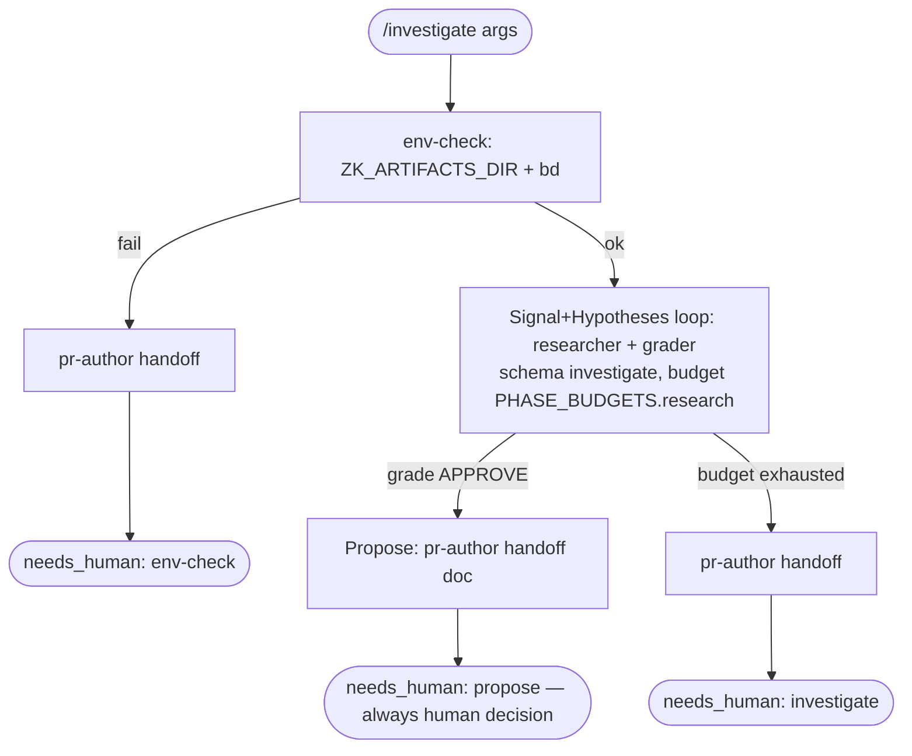

# investigate workflow

Production incident investigation: gather observability signals → map topology → past incident lookup → form ranked hypotheses → propose mitigations. **Never executes mitigations.** Always hands off to human.

Source: `src/workflows/investigate.src.js` (`meta.name = 'investigate'`).

## Command

```
/investigate [key=value ...]
```

| Arg | Meaning | Default |
|---|---|---|
| `brief=<text>` | Incident description (preferred) | Positional `_` joined |
| `service=<name>` | Affected service hint | Inferred from brief |
| `window=<duration>` | Observability lookback window | `now-1h` |
| `bead=<id>` | Correlation/run bead id | Derived from brief slug |
| `model=<tier\|id>` | Global model override | Per-phase defaults |

## Flow



## Observability routing

Per-machine via `$ZK_ARTIFACTS_DIR/skills/agent/machines/<alias>/observability.md`. For machine `n` (<org>):
- `grafana-infra` → <org>/PDU/vmalert/logs
- `grafana` → RDHx/SNMP
- `grafana-vin` → DataOne BMS

## Phases

| Phase | Agent | Schema | Rubric |
|---|---|---|---|
| Signal+Hypotheses | `researcher` | `schemas/investigate.json` | `prompts/rubrics/investigate-rubric.md` |
| Propose | `pr-author` | — | — (always handoff) |

## Output: investigate.json required fields

`outcome`, `affected_service`, `time_window`, `signals[]`, `hypotheses[]`, `mitigation_proposals[]`, `evidence_quality`

Each `mitigation_proposals[]` entry has: `proposal`, `risk_level`, `reversible`, `requires_human: true`, `runbook_ref?`

## Agents

| Agent | Phase | Role |
|---|---|---|
| `researcher` | Signal+Hypotheses | Queries Grafana MCP, maps topology via CGC, retrieves past incidents from vault, forms hypotheses |
| `pr-author` | Propose | Writes handoff doc to `$TMPDIR` with ranked hypotheses + mitigation proposals |

## Fragments used

`@@USE: run-phase,handoff,budgets,schemas,args,bd-memory,bead-run,model-tiers,env-check,guardrails,prompt-loader`

## Design: why no auto-mitigation

Unlike Google SRE's agents which can autonomously mitigate, zk-flow always hands off to human. Mitigation in production infra carries irreversible risk. The `requires_human: true` field is enforced on every proposal.

## Chain with /debug

```
/investigate → human approves mitigation → /debug brief="<root cause from investigation>"
```
