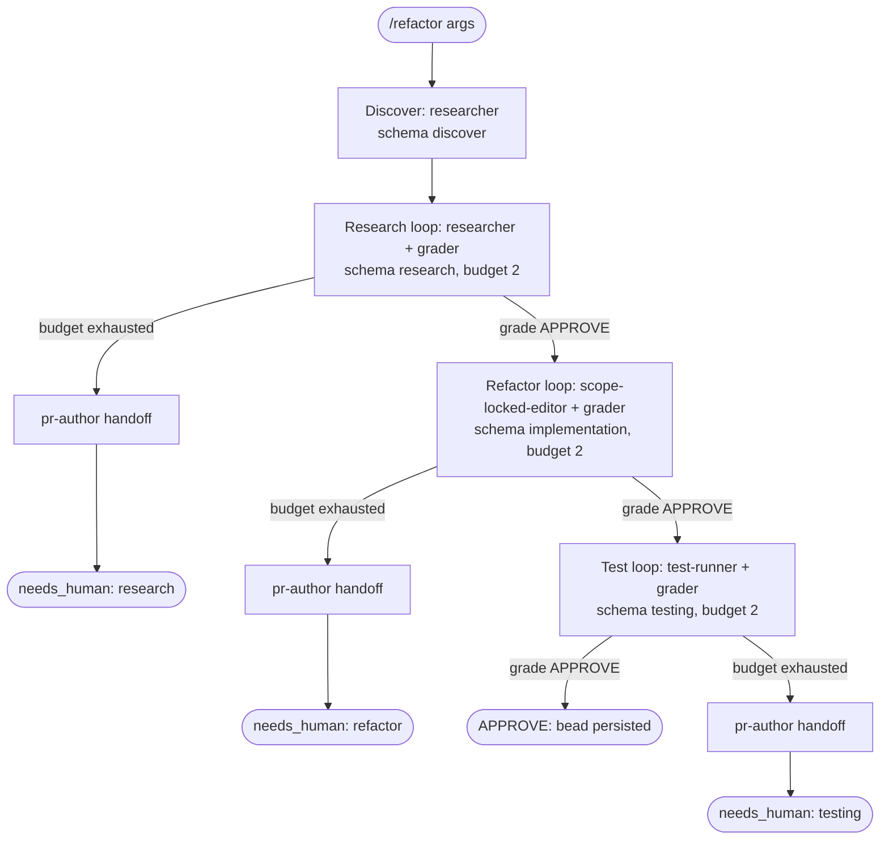

# refactor workflow

Refactor lifecycle that runs Discover -> Research -> Refactor -> Test. Restructures code WITHOUT changing observable behavior or public contracts. Uses CGC blast-radius analysis before every symbol edit.

Source: `src/workflows/refactor.src.js` (`meta.name = 'refactor'`).

## Command

```
/refactor <refactor target> [key=value ...]
```

Bare positional tokens collect under `a._` and are treated as the refactor description (joined with spaces); if absent the workflow tells agents to "infer from context". `key=value` tokens are parsed by `readArgs`/`parseArgs` only when the key is in the control-key allowlist. Of that allowlist, the args the refactor body actually consumes are:

| Arg | Meaning | Default / behavior |
|---|---|---|
| `_` (positional) | The refactor target description; injected into all phase prompts and used to derive the bead id. | If empty, prompts say "(infer from context)"; bead id falls back to `zkflow-run`. |
| `bead=<id>` | Correlation/run bead id. Normalized (non `[a-z0-9._-]` -> `-`, lowercased). Pass it to correlate re-runs. | If unset, id derived from `_` slug (first 40 chars), else `zkflow-run`. |
| `targetEnv=<env>` | Test environment injected into the Test phase prompt. | `local` |
| `model=<tier|id>` | Global model override applied to every phase. Accepts a tier name (`fast`/`mid`/`deep`) or a raw model id (passthrough). | Unset -> per-phase `PHASE_TIER` defaults. |
| `models=<phase:tier,...>` | Per-phase tier overrides, e.g. `models=research:deep,impl:fast`. Wins over `model` for the named phase. | Unset. |

Other allowlisted control keys (`depth`, `mode`, `maxIterations`, `startAt`, `pr`, `window`, `autoApprove`, `perspectives`, `brief`, `skipReview`) parse without error but are not read by the refactor body.

## Flow



Each phase runs through `runPhase`: the phase agent runs, then a `grader` agent emits a `review.json` verdict; the loop iterates on `REQUEST_CHANGES`/`BLOCK` (feeding `grade.findings` back as feedback) until `APPROVE` or the budget is hit. Phase outputs are persisted to the run bead after each green phase via `persistPhase`. There is no CI phase -- the Test phase runs the existing suite directly via `test-runner`.

## Agents

| Agent | Phase | Role | Model tier (default) |
|---|---|---|---|
| `researcher` | Discover, Research; all `persistPhase` helper calls | Investigates scope; maps blast radius via CGC callers/callees; enumerates call sites; picks skills/vault. | Discover: `modelFor('discover')` -> `mid` (sonnet-4-6). Research: `modelFor('research')` -> `mid`. Helper `persistPhase` calls pass NO model -> agent front-matter default opus-4-8. |
| `grader` | Research, Refactor, Test (gate step of each `runPhase` loop) | Grades phase output against rubric; emits `APPROVE`/`REQUEST_CHANGES`/`BLOCK`. Rejects Research if call sites are incomplete; rejects Refactor if behavior changed. | `gradeModel = modelFor('grade')` -> `deep` (opus-4-8). |
| `scope-locked-editor` | Refactor | The only writer; applies structural changes constrained to the blast radius found in Research; runs CGC before each symbol edit. | `modelFor('impl')` -> `mid` (sonnet-4-6); grader still `deep`. |
| `test-runner` | Test | Runs the existing suite and confirms no test changed semantics. | `modelFor('testing')` -> `mid` (sonnet-4-6). |
| `pr-author` | Handoff branches (research/refactor/testing budget failures) | Writes a handoff document per the handoff skill when a phase exhausts budget. | `modelFor('persist')` -> `fast` (haiku-4-5). |

## Schemas

| Phase | Schema | Enforces |
|---|---|---|
| Discover | `schemas/discover.json` | Requires `skills`, `vault_paths`, `related_beads`, `rationale`; `additionalProperties:false`. Picks skills to load and vault/bead context for downstream phases. |
| Research | `schemas/research.json` | Requires `outcome` (`const research_complete`), `task_context`, `key_findings[]` (each with `finding`/`evidence`/`evidence_quality`), and overall `evidence_quality` enum. Grader rejects if call sites are incomplete. |
| Refactor | `schemas/implementation.json` | Requires `outcome` (lifecycle enum), `files_changed[]`, `commits[]`, `tests_run/passed/failed`, `approach_rationale`. Optional `simplicity_check`. Grader rejects if public contracts changed. |
| Test | `schemas/testing.json` | Requires `outcome` (`testing_complete`/`smoke_unsupported`/`testing_failed`), `smoke_command`, `smoke_exit_code`, `scenarios_exercised[]`. |
| Grade gate (every loop) | `schemas/review.json` | `verdict` enum (`APPROVE`/`REQUEST_CHANGES`/`BLOCK`), `evidence_quality`, `weighted_score` (0-1), and `findings[]` with severity/owner/autofix_class/evidence. |

## Fragments used

Declared in the file header `// @@USE: run-phase,handoff,budgets,schemas,args,bd-memory,bead-run,model-tiers` (no ci-loop, no depth-map, no verdict).

- `run-phase` (`src/fragments/run-phase.js`) -- `runPhase`: the grade-gated bounded phase loop.
- `handoff` (`handoff.js`) -- `handoffPrompt(summary, suggestedNext)`: builds the handoff doc prompt.
- `budgets` (`budgets.js`) -- `PHASE_BUDGETS`: research 2, impl 2, testing 2.
- `schemas` (`schemas.js`) -- `SCHEMAS`: the inlined JSON-schema object literals.
- `args` (`args.js`) -- `readArgs`/`parseArgs` and the `CONTROL_KEYS` allowlist.
- `bd-memory` (`bd-memory.js`) -- `assertId`, `bdWrite` (the `bd create || ... | bd comment --stdin` shell snippet agents run).
- `bead-run` (`bead-run.js`) -- `runBeadId` (derive the correlation bead id) and `persistPhase` (spawns a researcher to run `bdWrite`).
- `model-tiers` (`model-tiers.js`) -- `MODEL_TIERS`, `PHASE_TIER`, and `modelFor(phase, a)`.

## Skills & prompts

Phase prompts (read by the relevant agent / its grader):

- Research: `prompts/phases/research.md`; rubric `prompts/rubrics/research-rubric.md` (grader additionally checks that ALL callers/callees are enumerated and blast radius is complete).
- Refactor (impl slot): `prompts/phases/implementation.md`; rubric `prompts/rubrics/implementation-rubric.md` (grader additionally checks behavior-preservation: no public contract changes).
- Test: `prompts/phases/testing.md` (read by `test-runner`); rubric `prompts/rubrics/testing-rubric.md`.

Skills pulled by agents (from `$ZK_ARTIFACTS_DIR/skills`):

- `researcher` discovers and selects skills via `glob "$ZK_ARTIFACTS_DIR/skills/**/SKILL.md"`, emitting `selected_skills[]`. CGC (`CodeGraphContext`) is the primary tool for blast-radius analysis.
- `scope-locked-editor` loads skills rendered into its prompt; runs CGC blast-radius before each symbol edit; applies the Simplicity-First self-check (`simplicity_check`).
- Handoff branches reference the handoff skill `$ZK_ARTIFACTS_DIR/skills/general/practices/handoff/SKILL.md`.

## Gates & escalation

- Budgets (`PHASE_BUDGETS`): research 2, refactor (impl slot) 2, test 2 iterations.
- `needs_human` triggers: a `runPhase` loop returns `ok:false` (no `APPROVE` within budget) for Research, Refactor, or Test. In each case a `pr-author` handoff doc is written first, then the workflow returns `{ verdict:'needs_human', phase:<name> }`.
- Research grader rejects if blast-radius call sites are incomplete (gradePrompt instructs rejection on missing callers/callees).
- Refactor grader checks behavior-preservation: if any public contract changed, it returns `REQUEST_CHANGES`.
- Success path: when Test grades `APPROVE`, the workflow persists `Test` to the run bead and returns `{ verdict:'APPROVE', bead:<id> }`. No GraderFeedback improve signal (refactor has no CI loop).
