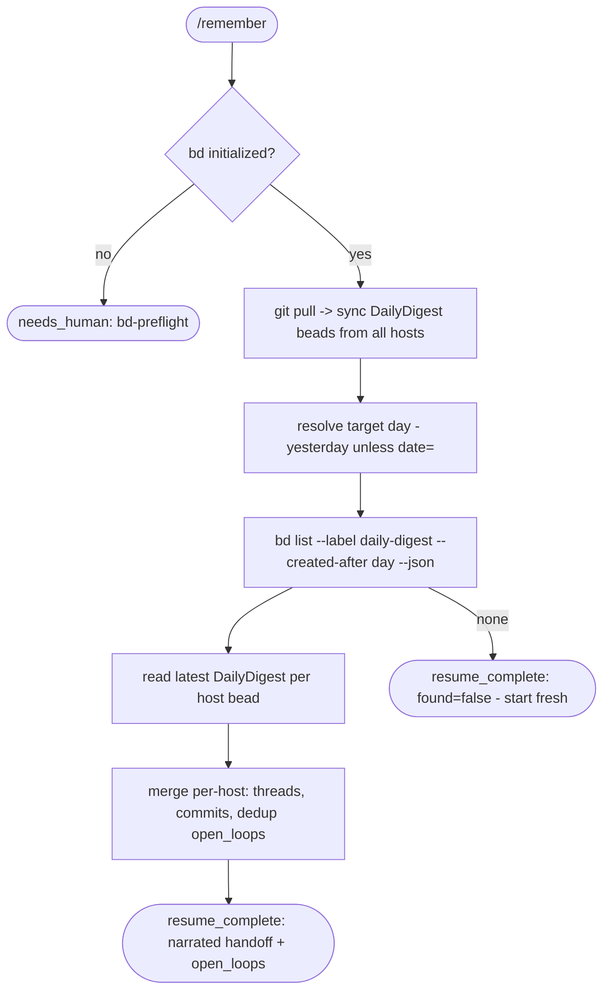

# remember workflow

Daily cross-machine handoff loader. Reads yesterday's `DailyDigest` beads from every host, merges them per-machine, and narrates where work left off so you can continue. The next-day half of the daily-digest system.

Source: `src/workflows/remember.src.js` (`meta.name = 'remember'`).

> Renamed from /resume -> /remember to avoid collision with Claude Code's built-in /resume.

## The daily-digest system

zk-flow runs on multiple machines with no shared end-of-day state. Three pieces close that gap (all deterministic, no LLM in the capture path):

1. **`scripts/daily-accumulate.sh`** — wired into the `Stop` hook. Tokenless. Appends one `{cwd, prompt, bead, ts}` line per turn to a host-scoped scratch log (`$ZKFLOW_DAILY_DIR/<host>-<YYYYMMDD>.jsonl`) and touches a `<host>.last-activity` marker. Never blocks the turn; exits 0 on any input.
2. **`scripts/daily-rollup.sh`** — run by a launchd timer (`StartInterval` 300s). Guards: **idle** (`last-activity` older than `ZKFLOW_IDLE_HOURS`, default 2h), **dirty** (scratch newer than the last rollup), **once-per-day**. On pass it structures the scratch + `bd list -s in_progress` + `git log --since=midnight` into a `DailyDigest` and writes a host-scoped bead `zk-flow-daily-<host>-<YYYYMMDD>` (label `daily-digest`), round-trip verified. No `bd dolt push` — the bead rides zk-flow's existing git-hook bead sync (`refs/dolt/data`).
3. **`/remember`** — this workflow. Loads and narrates.

Install the timer once per machine:

```
scripts/daily-rollup.sh --install
```

This writes `~/Library/LaunchAgents/com.zk-flow.daily-rollup.plist` (with `ZKFLOW_DAILY_DIR` / `ZK_FLOW_DIR` / `ZKFLOW_IDLE_HOURS` baked in, since launchd does not inherit the shell env) and `launchctl load`s it.

## Command

```
/remember [date=YYYY-MM-DD] [model=<tier|id>]
```

| Arg | Meaning | Default / behavior |
|---|---|---|
| `date=<YYYY-MM-DD>` | Load digests for a specific day. | Unset -> yesterday (computed in the agent shell via `date -v-1d` / `date -d yesterday`). |
| `model=<tier\|id>` | Model override for the load/narrate agent. | Per-phase default. |

## Flow



## Output

Returns `{ verdict: 'resume_complete', found, day, summary, open_loops[] }`. When no digest beads exist for the day, `found=false` and the summary says so plainly (no prior context — start fresh).

## Cross-machine model

Each host digests only its own local sessions (context-mode KB and session transcripts are per-machine). Host-scoped bead ids (`hostname -s`, lowercased) mean four machines never write-conflict; bd/dolt sync over the git remote is the aggregation layer. `/remember` reads every host's bead for the target day.
