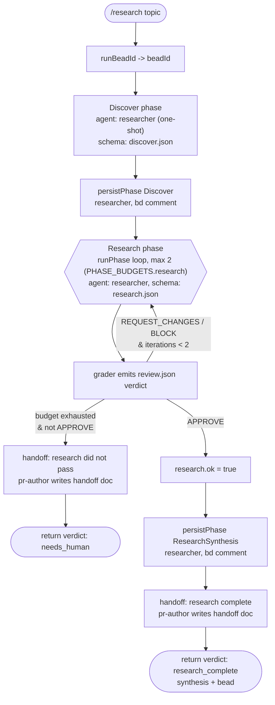

# research

Investigate a topic and STOP at a cited research synthesis: `discover -> research`. No design, no implementation. Use when you need evidence before committing to a solution.

## Command

```
/research <topic words...> [bead=<id>] [pr=<n>] [model=<tier|id>] [models=<phase:tier,...>]
```

The topic is free positional text (collected into `_`). Saved workflow commands pass the whole tail as a single string; `parseArgs` splits `key=value` tokens whose key is in the shared `CONTROL_KEYS` menu, everything else lands in `_`.

| Arg | Read by this workflow | Meaning | Default |
|-----|-----------------------|---------|---------|
| `_` (positional) | yes | The investigation topic. Joined with spaces into the discover/research prompts. | `(infer from context)` if empty |
| `bead` | yes (via `runBeadId`) | Explicit bead id to correlate/persist run memory under. Normalized: non-`[a-z0-9._-]` -> `-`, lowercased. | derived |
| `pr` | yes (via `runBeadId`) | PR-derived bead id (`zkflow-pr-<n>`) when no `bead` given. | derived |
| `model` | yes (via `modelFor`) | Global model override for all phases. Accepts a tier name (`fast`/`mid`/`deep`) or a raw model id. | per-phase `PHASE_TIER` |
| `models` | yes (via `modelFor`) | Per-phase tier overrides, e.g. `research:deep,grade:fast`. | per-phase `PHASE_TIER` |

Bead-id derivation (`runBeadId`): `bead=` wins; else `pr=` -> `zkflow-pr-<n>`; else a slug of the topic (first 40 chars) -> `zkflow-<slug>`; else `zkflow-run`.

Other `CONTROL_KEYS` tokens (`depth`, `mode`, `maxIterations`, `startAt`, `targetEnv`, `window`, `autoApprove`, `perspectives`, `brief`, `skipReview`) are accepted by the shared args parser but are NOT read by this workflow; they have no effect here.

## Flow



## Agents

Each agent's `.md` frontmatter pins `model: claude-sonnet-4-6`. The workflow overrides the model at dispatch via `modelFor(phase, a)` ONLY where it passes an explicit `model:` option. Calls with no `model:` option fall back to the frontmatter default (opus). The "model tier" column below reflects what the workflow actually dispatches.

| Agent | Phase / call | Role | Model tier (dispatched) |
|-------|--------------|------|-------------------------|
| `researcher` | Discover (`discover:1`) | Discover codebase scope; emit skills to load, vault paths, related bead ids, rationale. | `modelFor('discover')` -> mid (`claude-sonnet-4-6`) |
| `researcher` | Research (`research:N`) | Investigate topic; produce findings, evidence, gaps, synthesis, skill selection. | `modelFor('research')` -> mid (`claude-sonnet-4-6`) |
| `grader` | inside `runPhase` (`research-grade:N`) | Grade research output against the research rubric; emit binary verdict as `review.json`. | `modelFor('grade')` -> deep (`claude-sonnet-4-6`) |
| `researcher` | `persistPhase` (`persist:discover`, `persist:researchsynthesis`) | Run the `bd create`/`bd comment` shell to persist phase output to the bead. No `model:` option passed -> frontmatter default. | opus (`claude-sonnet-4-6`) |
| `pr-author` | handoff (`handoff:research`, `handoff:research-complete`) | Write a handoff document to `$TMPDIR` per the handoff skill; referenced on success and on budget-exhaustion failure. | `modelFor('persist')` -> fast (`claude-haiku-4-5`) |

`researcher.md`, `grader.md`, and `pr-author.md` all exist under `.claude/agents/`.

## Schemas

| Phase / call | Schema | Enforces |
|--------------|--------|----------|
| Discover | `SCHEMAS.discover` (`schemas/discover.json`) | Object requiring `skills`, `vault_paths`, `related_beads` (each `^[a-z0-9-]+$`), `rationale` (<=2000 chars); optional `iteration`. `additionalProperties: false`. |
| Research | `SCHEMAS.research` (`schemas/research.json`) | Object requiring `outcome` (const `research_complete`), `task_context`, `key_findings[]` (each: `finding`, `evidence` file:line/source, `evidence_quality` strong/adequate/weak), and top-level `evidence_quality`. Optional `affected_files`, `existing_patterns`, `gaps`, `skills_used`, `synthesis`, `selected_skills`, `vault_solutions_consulted`, `tools_used`, `assumptions[]`, `search_coverage` (agent_memory/vault/meetings/codebase/live_system booleans). |
| Grade (in `runPhase`) | `SCHEMAS.review` (`schemas/review.json`) | Object requiring `verdict` (APPROVE/REQUEST_CHANGES/BLOCK), `evidence_quality`, `weighted_score` (0..1), `findings[]` (each: title, severity P0-P3, file, why_it_matters, autofix_class, owner, evidence_quality, evidence[] min 1). The gate keys on `verdict === 'APPROVE'`. |

## Fragments used

Inlined at build time via the header `// @@USE: run-phase,handoff,budgets,schemas,args,bd-memory,bead-run,model-tiers`:

- `run-phase` — `runPhase({...})`: grade-gated bounded loop; runs the phase agent then a `grader` agent (emitting `review.json`), returns `{out, grade, ok, iterations}`; `ok` only when verdict is `APPROVE`.
- `handoff` — `handoffPrompt(summary, suggestedNext)`: builds the prompt instructing an agent to write a handoff doc to `$TMPDIR` per the handoff skill.
- `budgets` — `PHASE_BUDGETS`: iteration caps; research uses `PHASE_BUDGETS.research = 2`.
- `schemas` — `SCHEMAS`: the resolved JSON schemas (`discover`, `research`, `review`, etc.) inlined as object literals.
- `args` — `readArgs`/`parseArgs`: normalize the `args` string|object into `{ _, key:value }`, splitting only `CONTROL_KEYS`.
- `bd-memory` — `bdWrite`/`bdShow`/`bdReady`/`assertId`: build the `bd` shell snippets used to persist typed evidence comments.
- `bead-run` — `runBeadId(a)` and `persistPhase(beadId, type, payload)`: derive the run bead id and persist a phase payload as a typed `bd` comment (via a `researcher` agent running the shell).
- `model-tiers` — `MODEL_TIERS`, `PHASE_TIER`, `modelFor(phase, a)`: map phases to model ids, honoring `model`/`models` overrides.

Fragments NOT used here (despite being in the menu): `depth-map`, `verdict`, `ci-loop`.

## Skills & prompts

- The Research gate prompt is inline: `Grade this research against the research rubric: ...`. There is no `research-rubric.md` file (the `prompts/rubrics/` dir holds only `testing`, `proposal`, `review`, `design` rubrics); the rubric is referenced by name, and the grader emits a `review.json`-shaped verdict. No prompt file under `prompts/` is loaded by this workflow.
- The `researcher` agent loads skills from `$ZK_ARTIFACTS_DIR/skills/**/SKILL.md` (globs SKILL.md files and prunes to relevant ids) and searches `$ZK_ARTIFACTS_DIR/vault/` (Solutions/, Notes/, Inbox/, Source Material/, Map of Contents/) as its investigation protocol. Selected skill ids are emitted in `discover.skills` and `research.selected_skills`.
- The `pr-author` handoff calls instruct the agent to follow `$ZK_ARTIFACTS_DIR/skills/general/practices/handoff/SKILL.md`.

## Gates & escalation

- Budget: the Research phase runs at most `PHASE_BUDGETS.research = 2` iterations. Each iteration runs the `researcher`, then the `grader`; an `APPROVE` verdict ends the loop with `ok: true`. A non-APPROVE verdict feeds the grader `findings` back as feedback and retries until the budget is spent.
- `needs_human`: if `research.ok` is false (budget exhausted without an `APPROVE`), the workflow dispatches a `pr-author` handoff (`handoff:research`) with summary "research did not pass within budget" and suggested next step "rerun /research or refine the topic", then returns `{ verdict: 'needs_human', phase: 'research' }`.
- Discover is one-shot (not grade-gated); only Research carries a convergence loop.
- Success: on `APPROVE`, the synthesis is persisted to the bead (`persistPhase(beadId, 'ResearchSynthesis', ...)`), a final `pr-author` handoff (`handoff:research-complete`) is written suggesting `/design (pass bead=<beadId>)` or `/feature startAt=discover`, and the workflow returns `{ verdict: 'research_complete', synthesis, bead }`.
- Handoff docs are written to `$TMPDIR` (not committed) per the handoff skill; they reference artifacts by path/bead id and redact secrets.
