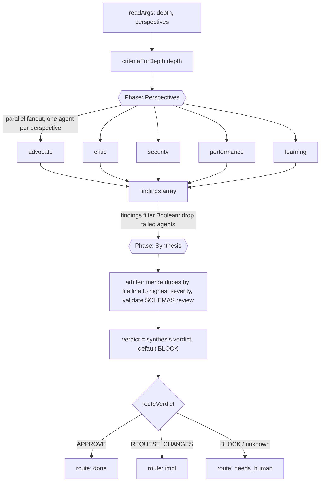

# review

Multi-perspective code review: fan out N perspective agents over the current diff in parallel, then synthesize their findings into a single verdict via an arbiter (depth modes none/light/standard/full).

## Command

Invoked by workflow name. There is no separate slash-command file; the runner passes a free-text argument string that `parseArgs` (src/fragments/args.js) splits into `key=value` control tokens (bare tokens collect under `_`).

```
review depth=full perspectives=security,performance
```

The workflow body (`src/workflows/review.src.js`, 31 lines) reads only `depth` and `perspectives` directly, and consumes `model`/`models` indirectly through `modelFor`. The other keys in `CONTROL_KEYS` (mode, maxIterations, startAt, targetEnv, window, autoApprove, bead, brief, skipReview, pr) are parsed by the shared parser but ignored by this workflow.

| Arg | Meaning | Default | Used here? |
|-----|---------|---------|-----------|
| `depth` | Review depth: `none`, `light`, `standard`, `full`. Selects the criteria set via `criteriaForDepth`; agents evaluate that depth and all shallower. | `standard` | yes (read directly) |
| `perspectives` | Comma list of perspective agents to fan out. Filtered by `validPerspectives` (defaults + opt-in `persona`, `repo-conventions`); empty/invalid falls back to the default 5. | the 5 defaults | yes (read directly) |
| `model` | Global model override (tier name `fast`/`mid`/`deep`, or a raw model id) applied to every phase. | none | yes (via `modelFor`) |
| `models` | Per-phase tier overrides, e.g. `review:deep,grade:mid`. | none | yes (via `modelFor`) |
| `mode`, `maxIterations`, `startAt`, `targetEnv`, `window`, `autoApprove`, `bead`, `brief`, `skipReview`, `pr` | Recognized control keys in the shared parser. | n/a | parsed but unused by this workflow |

`depth` criteria (from `src/fragments/depth-map.js`):
- `none`: (no criteria)
- `light`: correctness, obvious-bugs
- `standard`: + security, scope-alignment, error-handling, api-contract
- `full`: + performance, deployment-risk, maintainability

## Flow



This workflow body has no internal gate/retry loop and no handoff branch. The only branching is `routeVerdict` mapping the arbiter verdict to a downstream route string in the return value. Iteration limits and any retry loop are enforced by the external orchestrator, not by this workflow (see Gates below).

## Agents

All perspective agents fan out in parallel during Perspectives; the arbiter runs alone in Synthesis. The model tier below is what the workflow assigns at spawn time via `modelFor`, which overrides each agent file's own `model:` frontmatter (all six files declare `claude-opus-4-8`).

| Agent | Phase | Role | Model tier (spawn-time) |
|-------|-------|------|--------------------------|
| `advocate` | Perspectives | Finds strengths, positive patterns, quality wins; counterbalances critic | `review` -> mid (claude-sonnet-4-6) |
| `critic` | Perspectives | Finds risks, bugs, gaps, potential problems; counterbalances advocate | `review` -> mid (claude-sonnet-4-6) |
| `security` | Perspectives | Identifies vulnerabilities, unsafe patterns, attack vectors | `review` -> mid (claude-sonnet-4-6) |
| `performance` | Perspectives | Identifies latency, memory, and resource-exhaustion patterns | `review` -> mid (claude-sonnet-4-6) |
| `learning` | Perspectives | Extracts reusable knowledge for the skill system; emits skill suggestions, not go/no-go findings | `review` -> mid (claude-sonnet-4-6) |
| `arbiter` | Synthesis | Reconciles all perspectives, dedups findings (same file:line -> highest severity), produces the verdict | `grade` -> deep (claude-opus-4-8) |

Opt-in (non-default) perspectives permitted by `validPerspectives` but not run unless requested: `persona`, `repo-conventions` (agent files present).

Note: `learning.md` self-describes as running after the verdict and not affecting go/no-go. In this workflow it actually runs in parallel during Perspectives, so its output is part of the findings the arbiter synthesizes.

## Schemas

Only one schema is validated against in this workflow.

| Phase | Schema | Enforces |
|-------|--------|----------|
| Synthesis (arbiter) | `SCHEMAS.review` -> schemas/review.json | Required `verdict` (APPROVE/REQUEST_CHANGES/BLOCK), `evidence_quality` (strong/adequate/weak), `weighted_score` (0..1), and `findings[]`. Each finding requires title (<=120 chars), severity P0-P3, file, why_it_matters (<=280), autofix_class (safe_auto/gated_auto/manual/advisory), owner (review_fixer/downstream_resolver/human/release), evidence_quality, and >=1 evidence string. Optional: line, requires_verification, pre_existing, plus run-level perspectives_run, dedup_merges, suppressed_below_threshold. |

The Perspectives-phase agents are not passed a `schema` arg; only the arbiter call is.

## Fragments used

The `// @@USE` header inlines six fragments:

- `depth-map` (src/fragments/depth-map.js): `REVIEW_DEPTHS`, `DEFAULT_PERSPECTIVES` (advocate, critic, security, performance, learning), `validPerspectives()`, `criteriaForDepth()`.
- `verdict` (src/fragments/verdict.js): `routeVerdict()` mapping APPROVE->done, REQUEST_CHANGES->impl, BLOCK/unknown->needs_human.
- `budgets` (src/fragments/budgets.js): `PHASE_BUDGETS` constants (review:2, council:3, ...). Inlined but not referenced by the workflow body.
- `schemas` (src/fragments/schemas.js): `SCHEMAS` object re-exporting the JSON schemas; only `SCHEMAS.review` is used here.
- `args` (src/fragments/args.js): `parseArgs()`/`readArgs()` and the `CONTROL_KEYS` list.
- `model-tiers` (src/fragments/model-tiers.js): `MODEL_TIERS` (fast/mid/deep), `PHASE_TIER`, `modelFor()`.

Not used by this workflow (named in the broader fragment set but absent from its `@@USE`): run-phase, bd-memory, bead-run, ci-loop, handoff.

## Skills & prompts

- Perspective prompt scaffolds live under prompts/review-perspective/ (one per perspective: advocate, critic, security, performance, learning, arbiter). Their frontmatter `injected-by: src/prompts/review (review <perspective>)` indicates they are injected by the prompt layer at spawn time. The agent `.md` bodies themselves do not reference these prompt files.
- The arbiter prompt text in the workflow tells it to synthesize "using the review rubric (depth=...)". The matching rubric is prompts/rubrics/review-rubric.md, whose frontmatter says `injected-by: src/cli/spawner/grader.rs` and which is keyed by `ZK_REVIEW_DEPTH` (light/standard/full) with cumulative criteria.
- Skills: `learning` is the only perspective that touches the skills directory. It lists and searches `$ZK_ARTIFACTS_DIR/skills/` (via `mcp__octocode__localSearchCode`) to avoid re-documenting existing patterns before emitting a `skill_suggestion`. The other perspectives and the arbiter do not load skills.

## Gates & escalation

- Verdict routing is the only gate in the workflow body: `routeVerdict(verdict)` -> `done` (APPROVE), `impl` (REQUEST_CHANGES), or `needs_human` (BLOCK, and any unknown/missing verdict). The verdict defaults to `BLOCK` when the arbiter returns no `verdict`, so a malformed synthesis escalates to `needs_human` rather than silently passing.
- Failed perspective agents are tolerated: `findings.filter(Boolean)` drops null/failed agent outputs before synthesis; the run proceeds on whatever perspectives returned.
- Budgets: `PHASE_BUDGETS` declares review:2 and council:3, but this workflow does not read it. Iteration/retry budget enforcement and any re-review loop are the orchestrator's responsibility, external to this workflow.
- There is no `handoff` fragment and no explicit handoff branch here; `needs_human` is surfaced purely through the returned `route` value for an upstream caller to act on.
