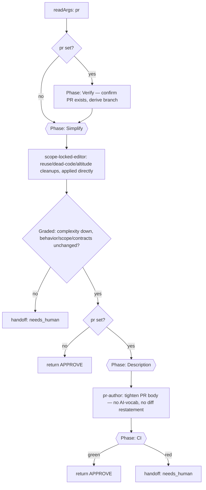

# simplify

Standalone quality-only pass: apply reuse/dead-code/altitude cleanups directly to a diff, then (when targeting an open PR) tighten the PR description and verify via CI. Does not hunt for correctness bugs — that's `review`/`critique`.

## Command

Invoked by workflow name. There is no separate slash-command file; the runner passes a free-text argument string that `parseArgs` (`src/fragments/args.js`) splits into `key=value` control tokens.

```
simplify pr=42
simplify pr=https://github.com/owner/repo/pull/42
simplify
```

| Arg | Meaning | Default |
|-----|---------|---------|
| `pr` | Target PR/MR (`<url>` or `<number>`). When set: checks out the source branch, applies fixes, commits + pushes, tightens the PR description, and watches CI. | none — local-only pass, no push, no description phase |
| `model` / `models` | Model override(s), same as every workflow. | none |

## Flow



## Why a separate workflow from `review`'s `simplify` perspective

`review`'s `simplify` perspective is **read-only** — findings only, routed through the same `review_fixer` path as every other perspective. This workflow is the **write path**: it applies the cleanups itself in one bounded pass, then re-verifies. Use `review` (or the `Simplify` phase built into `feature`) when you want findings as part of a broader review; use this workflow standalone when you specifically want a cleanup pass run and pushed, e.g. against an already-open PR that a reviewer flagged as over-engineered.

## Non-goals

- Does not fix correctness bugs, security issues, or performance problems — flag those via `review`.
- Does not change behavior, scope, or public contracts. The grader checks for this explicitly; a simplification that requires a behavior change routes to `needs_human` instead of being applied.
- Does not create a PR — it edits an existing one (`pr=`) or works locally. Pair with `finish-pr` or `feature`'s `pr-author` handoff to open one first.
