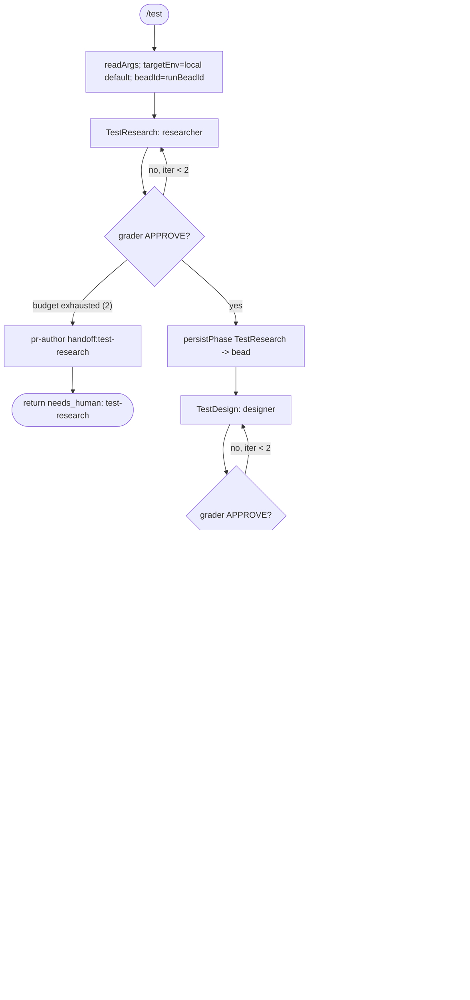

# `/test` workflow

Standalone test-strategy workflow run against an existing feature or PR: it researches how to test, designs a concrete test plan, then executes it in a target environment — each phase grade-gated, and each producing durable bead memory.

## Command

```
/test [targetEnv=<env>] [bead=<id>] [pr=<n>] [model=<tier|id>] [models=<phase:tier,...>] <free-text target>
```

Source: `src/workflows/test.src.js`. Args are parsed by the `args` fragment (`readArgs`/`parseArgs`); the saved command passes free text, so `key=val` tokens are split out and bare tokens collect under `_`.

| Arg | Read by | Meaning | Default |
|---|---|---|---|
| `targetEnv` | `a.targetEnv` | Environment the tests are designed/run against; interpolated into every phase prompt and the final verdict. | `local` |
| `bead` | `runBeadId(a)` | Explicit bead id to correlate the run; normalized (lowercased, non-`[a-z0-9._-]` → `-`). Pass it to avoid collisions across reruns (sandbox has no nonce). | — |
| `pr` | `runBeadId(a)` | Used only if `bead` is absent: derives bead id `zkflow-pr-<n>`. | — |
| `_` (positional) | `a._` | The test target (feature/PR description). Used in the TestResearch prompt and, if no `bead`/`pr`, to derive bead id `zkflow-<slug>` (else `zkflow-run`). | infer from context |
| `model` | `modelFor` (handoff only) | Global model override (tier name or raw id). In this workflow it is consulted **only** by the failure-handoff `modelFor('persist', a)` call. | — |
| `models` | `modelFor` (handoff only) | Per-phase tier overrides `phase:tier,...`. Same: only reachable via the handoff `modelFor('persist', a)`. | — |

Note: `parseArgs` also recognizes `depth`, `mode`, `maxIterations`, `startAt`, `window`, `autoApprove`, `perspectives`, `brief`, `skipReview` as control keys, but this workflow's body reads **none** of them — they are parsed and discarded.

## Flow



Every phase is a bounded grade-gated loop (`runPhase`): the phase agent runs, then a `grader` agent emits a `review.json` verdict. `APPROVE` exits the loop; otherwise the grader's findings are fed back as `fb` into the next iteration. All three loops cap at 2 iterations (`PHASE_BUDGETS`). Budget exhaustion in any phase spawns a `pr-author` handoff and returns `{ verdict: 'needs_human', phase }`.

## Agents

All phase/grader agents run at their **frontmatter default** model (`claude-sonnet-4-6`) — the `runPhase` calls pass no `model`/`gradeModel`, and `run-phase.js` only forwards a model when defined. The `PHASE_TIER` map (research/testing=`mid`) is **not** wired into this workflow. The only explicit tier selection is the handoff's `modelFor('persist', a)` → `fast` (haiku).

| Agent | Phase | Role | Model |
|---|---|---|---|
| `researcher` | TestResearch | Drives test research: scenarios, fixtures, env constraints, edge cases, risk areas; vault/skill discovery. | opus (frontmatter) |
| `designer` | TestDesign | Turns research into a concrete unit/integration/e2e/manual test plan executable in `targetEnv`. | opus (frontmatter) |
| `test-runner` | Run | Executes the test plan tier-2 (drive the real feature path), captures results/failures/evidence. | opus (frontmatter) |
| `grader` | every phase | Read-only; scores phase output vs the inline `gradePrompt`, emits `review.json` verdict that gates the loop. | opus (frontmatter) |
| `researcher` | persist (all phases) | `persistPhase` reuses the `researcher` agentType to run the `bd` shell that writes phase memory to the bead. | opus (frontmatter) |
| `pr-author` | handoff (failure) | On any phase budget exhaustion, writes a handoff doc per the handoff skill. | fast/haiku (`modelFor('persist')`) |

All four spawned agentTypes plus `pr-author` exist under `.claude/agents/`.

## Schemas

Phase outputs are validated against these JSON schemas (`schemas.js` → `SCHEMAS`). The grader output in every phase is validated against `review.json`.

| Phase | Schema | Enforces |
|---|---|---|
| TestResearch | `research.json` (`SCHEMAS.research`) | Requires `outcome`, `task_context`, `key_findings`, `evidence_quality`; allows `selected_skills`, `affected_files`, `gaps`, `search_coverage`, etc. |
| TestDesign | `design.json` (`SCHEMAS.design`) | Requires `outcome`, `overview`, `approach`, `test_strategy`; allows `acceptance_criteria`, `risks`, `blast_radius`, `subtasks`, etc. |
| Run | `testing.json` (`SCHEMAS.testing`) | Requires `outcome`, `smoke_command`, `smoke_exit_code`, `scenarios_exercised`; allows `ci_url`, `evidence_refs`, `fallback_used`, `target_env`. |
| grade (all phases) | `review.json` (`SCHEMAS.review`) | Requires `verdict` (enum `APPROVE`\|`REQUEST_CHANGES`\|`BLOCK`), `evidence_quality`, `weighted_score`, `findings`. Only `verdict === 'APPROVE'` passes the gate. |

## Fragments used

`// @@USE` line declares: `run-phase`, `handoff`, `budgets`, `schemas`, `args`, `bd-memory`, `bead-run`, `model-tiers`.

- `run-phase` — `runPhase(...)`: the bounded grade-gated loop (phase agent → grader → APPROVE-or-iterate, cap `maxIterations`).
- `handoff` — `handoffPrompt(summary, suggestedNext)`: builds the prompt instructing `pr-author` to write a handoff doc per the handoff skill.
- `budgets` — `PHASE_BUDGETS`: per-phase iteration caps (`research:2`, `design:2`, `testing:2`).
- `schemas` — `SCHEMAS`: the resolved JSON schema literals (inlined at build).
- `args` — `readArgs`/`parseArgs`: normalize `args` (string or object) into `{targetEnv, bead, pr, _, ...}`.
- `bd-memory` — `assertId`/`bdWrite`: validate bead ids and build the `bd comment` shell snippet for typed evidence.
- `bead-run` — `runBeadId(a)` (derive bead id) and `persistPhase(beadId, type, payload)` (write phase memory via a `researcher` agent running `bdWrite`).
- `model-tiers` — `MODEL_TIERS`/`modelFor`: consulted here only by the handoff `modelFor('persist', a)`.

Not in this workflow's `@@USE` (defined elsewhere but unused here): `depth-map`, `verdict`, `ci-loop`.

## Skills & prompts

- The grader scores against the **inline `gradePrompt`** strings the workflow passes per phase (test-research: scenario coverage / fixture completeness / env-constraint accuracy; test-design: concreteness / coverage breadth / executability in `targetEnv`; run: coverage / evidence quality / pass-fail clarity against the testing rubric). The grader agent itself maps phases to `prompts/rubrics/<phase>-rubric.md`; for the Run phase that is `prompts/rubrics/testing-rubric.md` (tier-2 real-feature exercise, `ZK_GRADER_MODE=1`, read-only). There is no `research-rubric.md`; `design-rubric.md` is the SQCA feature-design rubric.
- The `test-runner` follows `prompts/phases/testing.md` for its structured-output contract (exercise the feature path end-to-end, not re-run unit tests; emit `testing.json`).
- Skills are loaded by agents from `$ZK_ARTIFACTS_DIR/skills`: `researcher`/`designer` select and read `skills/<id>/SKILL.md` (rendered into prompts); the `pr-author` handoff references `skills/general/practices/handoff/SKILL.md`.

## Gates & escalation

- **Budgets**: each phase loops at most 2 times (`PHASE_BUDGETS.research`, `.design`, `.testing`). The loop passes only when the grader returns `review.json` `verdict === 'APPROVE'`.
- **needs_human**: if a phase's loop exhausts its 2 iterations without APPROVE, the workflow spawns a `pr-author` handoff (`label: handoff:<phase>`, model `modelFor('persist', a)` = haiku) and immediately `return`s `{ verdict: 'needs_human', phase: <test-research|test-design|run> }`.
- **Handoff**: the handoff doc is written to `$TMPDIR` per the handoff skill, summarizing state and a suggested next step (e.g. "rerun /test or refine the target"), referencing artifacts by path/bead id and redacting secrets.
- **Persistence**: on each phase pass, `persistPhase(beadId, <TestResearch|TestDesign|TestResults>, out)` writes typed evidence to the run bead via a `researcher` agent.
- **Success**: all three phases pass → `return { verdict: 'APPROVE', targetEnv, bead: beadId }`.
