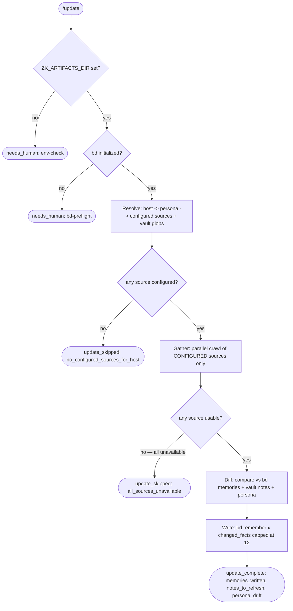

# update workflow

Session-end knowledge sync. **Resolves the current machine persona, then crawls ONLY the sources that machine has configured** (any of Telegram/Slack/Jira/GitHub/GitLab/Bitbucket), diffs the live state against bd memories + that machine's vault notes + persona, and writes deltas (capped `bd remember` + operator-gated vault refresh + schema-enforced persona-drift flag). Read-mostly: never overwrites vault notes or persona files autonomously.

The source set is **not hardcoded** — it is derived per host from the machine persona (`skills/agent/machines/<host>/`), so the same workflow works on `n` (telegram/slack/jira/github/gitlab), `n1` (jira/bitbucket/github), `sb` (slack/github), etc. A source the persona does not declare is reported `not_configured`; a declared source whose tool/auth fails at runtime is `unavailable`.

Source: `src/workflows/update.src.js` (`meta.name = 'update'`).

## Command

```
/update [model=<tier|id>]
```

| Arg | Meaning | Default |
|---|---|---|
| `model=<tier\|id>` | Model override for all phases | Per-phase defaults |

## Flow



## Phases

| Phase | Agent | Schema | Purpose |
|---|---|---|---|
| Resolve | `researcher` | `RESOLVE_SCHEMA` | Resolve host (`bd config get host`) -> persona dir -> which of the 6 sources are configured + this machine's vault globs |
| Gather | `researcher` | `GATHER_SCHEMA` | Parallel soft-fail crawl of the CONFIGURED sources only |
| Diff | `researcher` | `DELTA_SCHEMA` | Compare live state vs bd memories + vault + persona |
| Write | `persist` | `WRITE_RESULT_SCHEMA` | Persist deltas (precomputed, namespaced); surface refresh candidates |

## Source routing (crawled only if the persona declares it)

| Source | Tool / CLI | Status when absent |
|---|---|---|
| Telegram | `mcp__telegram__*` (channels from persona hint) | `not_configured` / `unavailable` |
| Slack | `mcp__claude_ai_Slack__*` | `not_configured` / `unavailable` |
| Jira | `mcp__claude_ai_Atlassian__*` (`cloudId` from persona hint) | `not_configured` / `unavailable` |
| GitHub | `gh` CLI (`gh search prs/issues`, `gh pr list`) | `not_configured` / `unavailable` |
| GitLab | `glab` CLI (`glab mr list`, `glab issue list`) | `not_configured` / `unavailable` |
| Bitbucket | `mcp__claude_ai_Atlassian__*` Bitbucket (rovo) | `not_configured` / `unavailable` |

`not_configured` = the resolved persona does not declare the source. `unavailable` = declared but its tool/auth failed at runtime. The workflow degrades gracefully: as long as one configured source returns `ok: true`, DIFF and WRITE proceed.

## Diff targets (resolved per machine)

| Target | Path |
|---|---|
| bd memories | `bd memories` (all) |
| Vault notes | `resolved.vault_globs` (e.g. `n` -> `vault/Notes/Work/<org>/*.md` + `Meetings/**/*.md`, last 30d) |
| Machine persona | `resolved.persona_dir` = `$ZK_ARTIFACTS_DIR/skills/agent/machines/<host>/` — `persona.md` + top-level `*.md` (datacenters/observability/RULES/tribal-knowledge) + `people/*.md` |

## Output contract

`update_complete`:

```json
{
  "verdict": "update_complete",
  "gathered": { "sources": [...] },
  "deltas": { "changed_facts": [...], "stale_notes": [...], "persona_drift_items": [...] },
  "memories_written": 3,
  "memories_skipped": 0,
  "notes_to_refresh": [{ "path": "vault/Notes/Work/<org>/...", "reason": "...", "repo": "infra-salt" }],
  "suggested_commands": ["/vault-sync repo=infra-salt"],
  "persona_drift": false,
  "persona_drift_items": [],
  "summary": "Updated 3 memories from 2/3 sources. Refresh repo-stale notes with: /vault-sync repo=infra-salt"
}
```

`update_skipped`: `no_configured_sources_for_host` (persona declares no sources / no persona for host) or `all_sources_unavailable` (every configured source failed at runtime).

`needs_human`: `ZK_ARTIFACTS_DIR` not set (`phase: 'env-check'`) or bd not initialized (`phase: 'bd-preflight'`).

## Write constraints

- `bd remember` is capped at `maxDeltas = 12`. Excess facts are counted in `memories_skipped`.
- Vault notes are NEVER overwritten. Stale notes appear in `notes_to_refresh[]` for the operator to act on.
- When the DIFF phase can attribute a stale note to a repo, it sets `repo` on that entry and the workflow emits the fix as a command in `suggested_commands[]` — `/vault-sync repo=<x>`, the workflow that IS allowed to rewrite notes. See [vault-sync.md](vault-sync.md); the two share `src/fragments/knowledge-sync.js` (untrusted fence, key sanitizer, env+bd preflight) but stay separate because this one ingests adversary-writable text and never writes files.
- Persona files are NEVER rewritten. Drift is a `persona_drift: boolean` flag + `persona_drift_items[]` for operator review.

## Fragments used

`@@USE: handoff,schemas,args,bd-memory,model-tiers,env-check,operating-posture,knowledge-sync`
